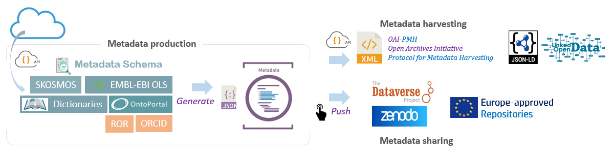

# About

### Maggot, a research data cataloging tool 

#### Motivations

* Meet the challenges of organizing, documenting, storing and sharing data within a collective (unit, platform, project, etc.).
* Have visibility of what is produced within the collective: datasets, software, images, sounds, videos, analyses, codes, etc.
* Fall within an open science approach for sharing and reproducibility by promoting FAIR principles within the collective.
* Raise awareness among newcomers and students about a better description of what they produce.

#### Main objectives

Data sharing still arouses a great deal of reluctance, sometimes justified, but often masking a lack of will. The main objective is therefore to start by creating a culture of sharing metadata, which describes relevant information about the data by giving it more context for users, and which is therefore less sensitive than the data. This is also and above all one of the prerequisites for open science.

The first step is to promote good data management, while keeping metadata sharing in mind. One of the main concerns has focused on how to "capture" descriptive metadata as easily as possible by mobilizing users' vocabulary, then structuring it for **1**) transparency and reproducibility, **2**) reuse. Regarding the latter point, there is the aim of one day being able to conduct large-scale meta-analyses. This is why metadata is crucial, but not only that.

#### Methodology

Since the organization of metadata must follow a schema (i.e., indicating which metadata are expected), the one proposed is based on [the Dataverse Project][26]{:target="_blank"} used by many scientific institutions (e.g. the French institutional data warehouse, namely [Recherche Data Gouv][1]{:target="_blank"}). This is the default schema that we recommend using. It is nevertheless possible to adapt it.

Concerning semantics, we recommend a gradual approach towards the adoption of standardized [controlled vocabularies][2]. For example, a simple dictionary of business vocabulary used by the community in the scientific field concerned may be perfectly sufficient. Subsequently, the creation of a thesaurus with or without correspondence with existing ontologies can be considered or, better still, enriching existing ones (e.g., [Thesaurus-INRAE][3]{:target="_blank"}). Obviously, when they exist, the ontologies of the domain can be chosen progressively by selecting those which are relevant for the collective and by drawing up a comprehensible landscape of the context in which they are included.

The metadata thus produced are used to feed a local data warehouse intended to be subsequently consulted by all the people in the collective. Hence the importance of both the metadata schema and the vocabulary repositories specific to each collective. But these same metadata can also feed other warehouses, e.g. [Recherche Data Gouv][1]{:target="_blank"} and [Zenodo][4]{:target="_blank"}. Similarly, these metadata must be able to be harvested in order to carry out meta-analyses. It is therefore necessary to set up [gateways][5] between the different formats.

#### Tools and technologies

There are three main classes of vocabularies: thesauri, ontologies, and non-hierarchical vocabularies in the form of a simple list. All of these vocabularies are made available on the Internet via dedicated portals, and given the volumes of data that this represents, the chosen option is to retrieve them on demand using a connector on these portals – via APIs (Application Program Interface [Application Program Interface][12]{:target="_blank"}).

Among the supported portals, we can cite those based on ontology portals based on [OntoPortal][6]{:target="_blank"} – such as [AgroPortal][7]{:target="_blank"} and [BioPortal][8]{:target="_blank"}, those based on [SKOSMOS][9]{:target="_blank"} (e.g. [Thesaurus-INRAE][3]{:target="_blank"}, [LOTERRE][10]{:target="_blank"}) as well as the EMBL-EBI portal ([Ontology Lookup Service][11]{:target="_blank"}). While a SKOSMOS-type portal is dedicated only to thesauri, OntoPortal-type portals can host both thesauri and ontologies. Support for all these portals thus allows for a wide variety of vocabularies.

Other additional but useful resources are also used (via their API) in order to minimize entries and therefore identification errors, but also to avoid duplicates. Examples include the international register of institutions ([Research Organization Registry][13]{:target="_blank"}), or the register of persistent identifications for people ([ORCID][14]{:target="_blank"}).

Regarding metadata harvesting, which consists of collecting metadata via an API in order to store it on another platform, the choice fell on the standard [OAI-PMH][15]{:target="_blank"} protocol (Open Archives Initiative - Protocol for Metadata Harvesting]) based on the [DublinCore][16]{:target="_blank"} metadata schema. Similarly, metadata can also be harvested in [JSON-LD][17]{:target="_blank"} format based on the [schema.org][18]{:target="_blank"} metadata schema. In both cases, gateways - [metadata crosswalk][5] - were set up.

#### Locks and levers

Data management is still far from being a major concern in collectives, even when it is stated as an objective to be achieved within the framework of a data policy, often included in a quality approach. This is why it is often necessary to emphasize that "Open Data" does not mean "Open Bar" Metadata alone may very well be sufficient, provided that the conditions under which the data is accessible are specified. It is therefore urgent to develop a culture of metadata sharing.

Furthermore, in response to the time dedicated to this task, tools that simplify data entry as much as possible are needed. For example, it is easier to select a term from a drop-down list based on professional vocabulary than to choose from a multitude of ontologies. It is therefore not surprising that the greatest difficulty encountered by the various sites was undoubtedly the choice of a controlled vocabulary repository. Indeed, it is common for one not to be able to find all the desired terms to describe a metadata item within a thesaurus, an ontology, or even a set of ontologies. In particular, many business vocabularies are absent from these repositories. The solution in these cases consists of creating a dictionary grouping all the desired terms by mixing those from one or more ontologies, those from thesauri, as well as the business vocabularies. This constitutes a sort of new mini-thesaurus. Therefore, a [data manager][25] is required who, upstream, does this compilation work and thus constitutes a controlled vocabulary repository, evolving over time, as part of a process of continuous improvement.

Enabling producers to obtain metadata that better respects the [FAIR principles][24]{:target="_blank"}, without them always being fully aware of this, was also one of the objectives, achieved by distributing the concerns between the different actors (data managers, data producers, data curators) according to their [skills and responsibilities][25].

#### Perspectives

Since the "capture" of metadata is crucial, it should ideally be done uniquely and at the most relevant stage of the data lifecycle for each of them (e.g., the name of a project at the time of its submission to funders). On the other hand, each entry can be a source of error, confusion, or duplication. This is why it is necessary to reinforce the tendency to interconnect the different online resources within an information flow following a logic of stages. The description of the project, the participants, with general keywords (ANR type resources), then comes the data management plan ([DMP][19]{:target="_blank"}) where we describe the types of data, the licenses, etc. (e.g., [DMP Opidor][20]{:target="_blank"}) then the descriptive metadata specific to each project (e.g., [Maggot][21]), and finally the structural metadata of each dataset (e.g., [ODAM][22]{:target="_blank"}), until the final dissemination (e.g., [Dataverse][1]{:target="_blank"}). Consequently, at each stage, we must retrieve the metadata upstream and then transmit them downstream with added value specific to each stage. This is called “[machine actionable][23]{:target="_blank"}” i.e., exploitability by the machine.

[1]: https://entrepot.recherche.data.gouv.fr/
[2]: https://inrae.github.io/pgd-mmdt/chats/chat3/
[3]: https://science-ouverte.inrae.fr/fr/offre-service/enrichir-ses-donnees-par-un-vocabulaire-controle
[4]: https://zenodo.org/
[5]: https://inrae.github.io/pgd-mmdt/chats/chat4/
[6]: https://ontoportal.org/ 
[7]: https://agroportal.lirmm.fr/ 
[8]: https://bioportal.bioontology.org/ 
[9]: https://skosmos.org/ 
[10]: https://loterre.istex.fr/fr/ 
[11]: https://www.ebi.ac.uk/ols4/ 
[12]: https://en.wikipedia.org/wiki/API
[13]: https://ror.org/ 
[14]: https://orcid.org/ 
[15]: https://www.openarchives.org/pmh/ 
[16]: https://dublincore.org/about/ 
[17]: https://json-ld.org/ 
[18]: https://schema.org/ 
[19]: https://en.wikipedia.org/wiki/Data_management_plan
[20]: https://dmp.opidor.fr/
[21]: https://inrae.github.io/pgd-mmdt/
[22]: https://inrae.github.io/ODAM/
[23]: https://ds-wizard.org/machine-actionability
[24]: https://www.ccsd.cnrs.fr/en/fair-guidelines/
[25]: https://inrae.github.io/pgd-mmdt/chats/chat1/
[26]: https://dataverse.org/

---

### Links

* **Source code on Github** : [inrae/pgd-mmdt][100]{:target="_blank"}
* **Issues tracker** : [inrae/pgd-mmdt/issues][101]{:target="_blank"}
* **Instance online** : [INRAE UMR 1322 BFP][102]{:target="_blank"}

### Publication

* Daniel Jacob, François Ehrenmann, Romain David, Joseph Tran, Cathleen Mirande-Ney, Philippe Chaumeil, An ecosystem for producing and sharing metadata within the web of FAIR Data, GigaScience, Volume 14, 2025, giae111, [DOI:10.1093/gigascience/giae111](https://academic.oup.com/gigascience/article/doi/10.1093/gigascience/giae111/7945442){:target="_blank"}

### Related articles

* Usages d'AgroPortal dans des systèmes d'information à INRAE - [hal-05077024][201]{:target="_blank"}
* Créez, gérez et partagez vos métadonnées avec Maggot - [VO-INRAE][202]{:target="_blank"}

### Contacts

* Daniel Jacob ([INRAE UR BIA-BIBS][105]{:target="_blank"} - [0000-0002-6687-7169][104]{:target="_blank"})

### Designers / Developers

* Daniel Jacob ([INRAE UR BIA-BIBS][105]{:target="_blank"})

* François Ehrenmann ([INRAE UMR BioGECO][106]{:target="_blank"})

* Philippe Chaumeil ([INRAE UMR BioGECO][106]{:target="_blank"})

### Contributors

* [INRAE](https://www.inrae.fr/en){:target="_blank"}
    * Edouard Guitton ([Dept. SA][110]{:target="_blank"}, [Emerg'IN][107]{:target="_blank"}), David Benaben  & Cathleen Mirande-Ney ([UMR BFP][114]{:target="_blank"}), Joseph TRAN ([UMR EGFV][112]{:target="_blank"}), Stéphane Bernillon ([UR MycSA][113]{:target="_blank"})

* [CIRAD](https://www.cirad.fr/en){:target="_blank"}
    * Julien Paul ([AGAP institute][111]{:target="_blank"})

* [ERINHA][109]{:target="_blank"}
    * Romain David 

* [Mines de Paris - PSL][108]{:target="_blank"}
    * Amélie Masson, Sandrine Mouret, Sébastien Perrin

### License

* GNU GENERAL PUBLIC LICENSE Version 3, 29 June 2007 - [GPLv3][200]{:target="_blank"}

*[JSON]: JavaScript Object Notation : format used to represent structured information
*[autocompletion]: feature in which an application predicts the rest of a word a user is typing
*[FAIR]: Findable, Accessible, Interoperable and Reusable

[100]: https://github.com/inrae/pgd-mmdt
[101]: https://github.com/inrae/pgd-mmdt/issues
[102]: https://pmb-bordeaux.fr/maggot/

[104]: https://orcid.org/0000-0002-6687-7169
[105]: https://eng-ur-bia.angers-nantes.hub.inrae.fr/
[106]: https://www6.bordeaux-aquitaine.inrae.fr/biogeco_eng/
[107]: https://www.emergin.fr/emergin_eng/
[108]: https://www.minesparis.psl.eu/en/mines-paris-psl/
[109]: https://erinha.eu/
[110]: https://www.inrae.fr/en/divisions/sa
[111]: https://umr-agap.cirad.fr/en
[112]: https://eng-egfv.bordeaux-aquitaine.hub.inrae.fr/
[113]: https://eng-mycsa.bordeaux-aquitaine.hub.inrae.fr/
[114]: https://eng-bfp.bordeaux-aquitaine.hub.inrae.fr/

[200]: https://www.gnu.org/licenses/gpl-3.0.html
[201]: https://hal.science/hal-05077024
[202]: https://vocabulaires-ouverts.inrae.fr/outil-maggot/

  

  