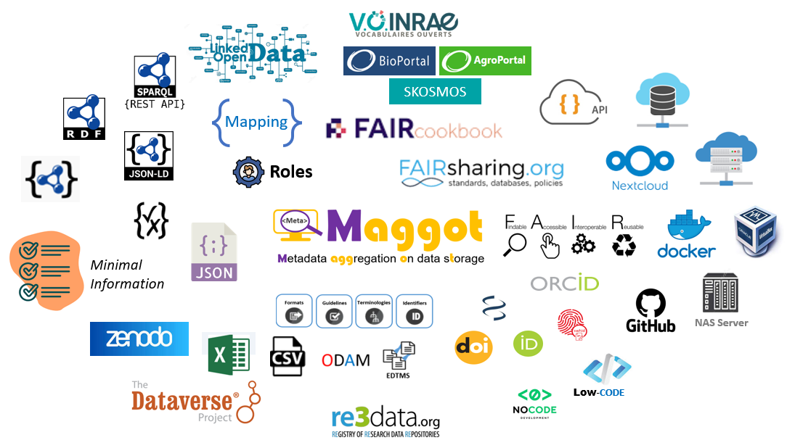

# About

### Background

#### Motives

* Meet the challenges of organizing, documenting, storing and sharing data from a site, a project or a structure (unit, platform, etc.).
* Have visibility of what is produced within the collective: datasets, software, databases, images, sounds, videos, analyses, codes, etc.
* Fall within an open science quality approach for sharing and reproducibility.
* Promote FAIR (at least the Findable & Accessible criteria) within the collective.
* Raise awareness among newcomers and students about a better description of what they produce.

#### State of need

* Implementing a data management plan imposes prerequisites such as the externalization of data to be preserved outside of users' disk space. This does not only concern published data but all data produced during the duration of a project. Above all, this outsourcing makes it possible to gather the data in one place and already constitutes a first-level backup. This becomes even more necessary when temporary agents (doctoral students, post-docs, interns, fixed-term contracts) are involved in data production.
* Consequently, the concern arises about the organization of these storage spaces. Should they be harmonized, i.e. impose good practices such as _i_) the naming of folders and files, _ii_) a folder structure (docs, data, scripts, etc.), _iii_) the use of README files, etc.
* At a minimum, using a README file seems the simplest and least restrictive. But then the question arises “what to put in it”? Templates can be offered to simplify their writing. But then the question arises of how to use them effectively when we want to find information? With what vocabulary?

#### Proposed approach

* The two main ideas behind the tool are:
     * Make the data storage space a data repository without having to move the data, then ensure that the metadata gets to the data.
     * Be able to “capture” the user’s metadata as easily as possible by using their vocabulary.
* Concerning the first idea: "Just" place a metadata file (JSON format) describing the project data in each subdirectory, and then find the projects and/or data corresponding to specific criteria. The choice fell on the JSON format, very suitable for describing metadata, readable by both humans and machines.
* Concerning the second idea: Given the diversity of the fields, the approach chosen is to be both the most flexible and the most pragmatic possible by allowing users to choose their own vocabulary (controlled or not) corresponding to the reality of their field and their activities. However, a good approach is as much as possible to use only controlled vocabulary, that is to say relevant and sufficient vocabulary used as a reference in the field concerned to allow users to describe a project and its context without having to add additional terms. To this end, the tool must allow users a progressive approach towards the adoption of standardized controlled vocabularies (thesauri or even ontologies).

* With the approach proposed by Maggot, initially there is no question of opening the data, but of managing metadata associated with the data on a storage space with a precise perimeter represented by the collective (unit, team, project , platform, …). The main characteristic of the tool is, above all, to “capture” the metadata as easily as possible according to a well-chosen metadata schema. However, the opening of data via their metadata must be a clearly stated objective within the framework of projects financed by public institutions (e.g Europe). Therefore if you have taken care to correctly define your metadata schema so that it is possible to make a [metadata crosswalk](../chats/chat4){:target="_blank"} (using a mapping file) with a data repository recognized by the international community, then you can easily "push" its metadata with the data without having re-enter anything.

---

### Links

* **Source code on Github** : [inrae/pgd-mmdt][10]{:target="_blank"}
* **Issues tracker** : [inrae/pgd-mmdt/issues][16]{:target="_blank"}
* **Instance online** : [INRAE UMR 1322 BFP][11]{:target="_blank"}

### Preprint

* D. Jacob, F. Ehrenmann, R. David, J. Tran, C. Mirande-Ney, P. Chaumeil (2024) Maggot: An ecosystem for sharing metadata within the web of FAIR Data, BioRxiv, [DOI:10.1101/2024.05.24.595703](https://www.biorxiv.org/content/10.1101/2024.05.24.595703v1.full){:target="_blank"}

### Contacts

* Daniel Jacob ([INRAE UMR BFP][2]{:target="_blank"}) : [daniel.jacob @ inrae.fr][17]{:target="_blank"}

### Designers / Developers

* Daniel Jacob ([INRAE UMR BFP][2]{:target="_blank"}) | CATI [PROSODIe][4]{:target="_blank"}

* François Ehrenmann ([INRAE UMR BioGECO][1]{:target="_blank"}) | CATI [GEDEOP][5]{:target="_blank"}

* Philippe Chaumeil ([INRAE UMR BioGECO][1]{:target="_blank"})

### Contributors

* Edouard Guitton ([INRAE Dept. SA][6]{:target="_blank"}, [Emerg'IN][3]{:target="_blank"})

* Stéphane Bernillon ([INRAE UR MycSA][14]{:target="_blank"})

* Joseph TRAN ([INRAE UMR EGFV][12]{:target="_blank"}) | CATI [BARIC][13]{:target="_blank"}

*[JSON]: JavaScript Object Notation : format used to represent structured information
*[autocompletion]: feature in which an application predicts the rest of a word a user is typing
*[FAIR]: Findable, Accessible, Interoperable and Reusable

[1]: https://www6.bordeaux-aquitaine.inrae.fr/biogeco_eng/
[2]: https://eng-bfp.bordeaux-aquitaine.hub.inrae.fr/
[3]: https://www.emergin.fr/emergin_eng/
[4]: https://prosodie.cati.inrae.fr/
[5]: https://gedeop.cati.inrae.fr/
[6]: https://www.inrae.fr/en/divisions/sa
[7]: https://nextcloud.inrae.fr/s/HxEWSybeBW8rzke
[8]: https://recherche.data.gouv.fr/en
[9]: https://nextcloud.inrae.fr/s/iLHQYoAZp2i6ij7

[10]: https://github.com/inrae/pgd-mmdt
[11]: https://pmb-bordeaux.fr/maggot/

[12]: https://eng-egfv.bordeaux-aquitaine.hub.inrae.fr/
[13]: https://www.cesgo.org/catibaric/
[14]: https://eng-mycsa.bordeaux-aquitaine.hub.inrae.fr/

<!-- https://www.google.com/search?q=metadata+crosswalk+definition&oq=metadata+crosswalk -->

[16]: https://github.com/inrae/pgd-mmdt/issues
[17]: https://orcid.org/0000-0002-6687-7169

  

  