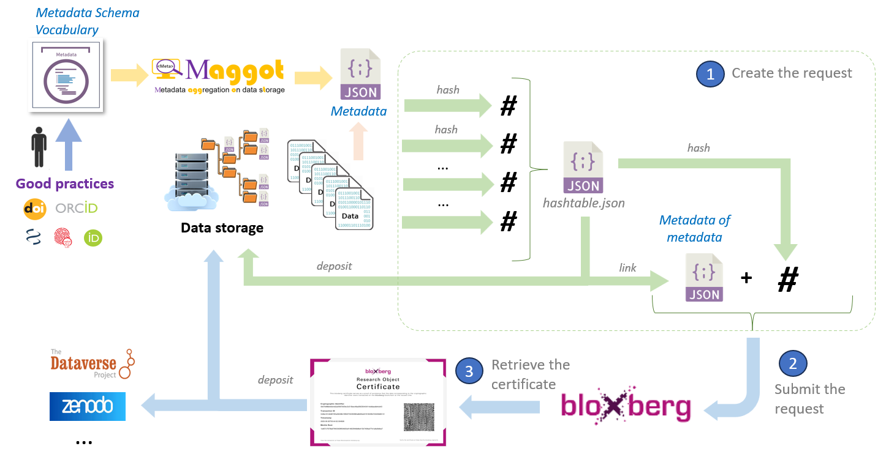

# Bloxberg Blockchain

###  EXPERIMENTAL - Certification of metadata file on the bloxberg blockchain

#### Motivation

To guarantee the authenticity and integrity of a metadata file by recording it permanently and immutably on the [bloxberg blockchain][1]{:target="_blank"}.

Indeed, the [blockchain][2]{:target="_blank"} is a technology that makes it possible to keep track of a set of transactions (writings in the blockchain), in a decentralized, secure and transparent manner, in the form of a blockchain. A blockchain can therefore be compared to a large (public or private) unfalsifiable register. Blockchain is today used in many fields because it provides solutions to many problems. For example in the field of Higher Education and Research, registration of dataset metadata in the blockchain, makes possible in this way to certify, in an inalienable, irrefutable and completely transparent manner, the ownership and authenticity of the data as well as for example, the license of use and the date of production of the data. Research stakeholders are then more open to the dissemination of their data (files, results, protocols, publications, etc.) since they know that, in particular, the ownership, content and conditions of use of the data cannot not be altered.

The Maggot tool could thus serve as a gateway to certify its data with the associated metadata. The complete process is schematized by the following figure:

#### About bloxberg

[bloxberg][1]{:target="_blank"} is the most important [blockchain][2]{:target="_blank"} project in science. It was founded in 2019 by [MPDL][4]{:target="_blank"} , looking for a way to store research results and make them available to other researchers. In this sense, bloxberg is a decentralized register in which results can be stored in a tamper-proof way with a time stamp and an identifier.

bloxberg is based on the [Ethereum Blockchain][3]{:target="_blank"}. However, it makes use of a different consensus mechanism: instead of “[Proof of Stake][9]{:target="_blank"}” used by Ethereum since 2022, bloxberg validates blocks through “[Proof of Authority][10]{:target="_blank"}”. Each node is operated by one member. All members of the association are research institutions and are known in the network.  Currently, bloxberg has [49 nodes][12]{:target="_blank"}. It is an international project with participating institutions from all over the world.

#### How to process ?

You will need a [Ethereum address][5]{:target="_blank"} and an API key (must be requested via bloxberg-services (at) mpdl.mpg.de). See an [example of pushing][11]{:target="_blank"} a metadata file to the bloxberg blockchain using Maggot.

 

#### Useful links

* [Bloxberg Documentation][6]{:target="_blank"}
* [Blockexplorer][8]{:target="_blank"}
* [Blockchain ESR][7]{:target="_blank"} (France)

   

[1]: https://bloxberg.org/
[2]: https://en.wikipedia.org/wiki/Blockchain
[3]: https://en.wikipedia.org/wiki/Ethereum
[4]: https://www.mpdl.mpg.de/en/
[5]: https://info.etherscan.com/what-is-an-ethereum-address/
[6]: https://bloxberg.org/developers-hut/documentation/
[7]: https://forgemia.inra.fr/cedric.goby/blockchain-esr
[8]: https://blockexplorer.bloxberg.org/
[9]: https://en.wikipedia.org/wiki/Proof_of_stake
[10]: https://en.wikipedia.org/wiki/Proof_of_authority
[11]: https://inrae.github.io/pgd-mmdt/pdf/MAGGOT_Tests_Push_bloxberg_Nov2023.pdf?download=false
[12]: https://bloxberg.org/organization/