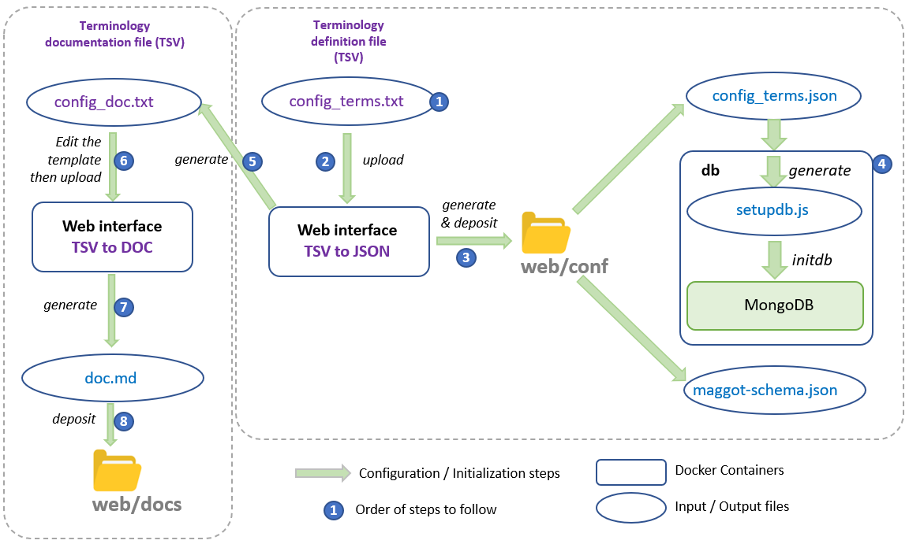

# Configuration

### Terminology configuration

A single file (***web/conf/config_terms.txt***) contains all the [terminology](../definitions/terminology/). The input and search interfaces are completely generated from this definition file, thus defining each of the fields, their input type (*checkbox*, *dropbox*, *textbox*, ...) and the associated controlled vocabulary (ontology and thesaurus by autocompletion, drop-down list according to a list of fixed terms). This is why a configuration and conversion step into JSON format is essential in order to be able to configure all the other modules (example: creation of the [MongoDB][1]{:target="_blank"} database schema when starting the application before filling it).

* **_Note_** : _The step numbers shown in the figure above are mentioned in brackets in the text below_.

#### TSV to JSON

* This function is used to generate the terminology definition file in JSON format (**_config_terms.json_**) and the corresponding JSON-Schema file (**_maggot-schema.json_**) from a tabulated file (**1**). You can either create a terminology definition file in TSV format from scratch (see below to have more details), or extract the file from the current configuration (see [JSON to TSV](#json-to-tsv)).

* Once the terminology definition file has been obtained (**2**), you can load it and press 'Submit'.

* Three files are generated (**3** & **5**):
   * **_config_terms.json_** and **_maggot-schema.json_** : These files should be placed in the web/conf directory (**3**). A (re)start of the application must be done in full mode (**4**) (**_sh ./run fullstart_**)
   * **_config_doc.txt_** (**5**) : This file serves as a template for the documentation of the metadata profile. You should edit it with a spreadsheet program, and fill in the description column (**6**). Then it is used to generate the documentation file in markdown format (see TSV to DOC).

#### TSV to DOC

* This function generates the markdown documentation file (**_doc.md_**) from the template file (**_config_doc.txt_**) which is itself generated from the metadata definition file (**_config_terms.txt_**, cf [TSV to JSON](#tsv-to-json)).

* Once the template file for the documentation (**_config_doc.txt_**) has been edited and documented (**6**) (see below to have more details), you can load it and press _Submit_ button.

* The documentation file in markdown format (**_doc.md_**) is thus generated (**7**) and must be placed in the **_web/docs_** directory (**8**). Users will have access to this documentation file via the web interface, in the documentation section, heading "**Metadata**".

#### JSON to TSV

* This function allows you to extract the terminology definition file in TSV format (**_config_terms.txt_**) from the current configuration. This allows you to start from this file, either to adapt your own metadata profile or simply to modify it slightly.

 

*[TSV]: Open text format representing tabular data as "Tab-Separated Values". Each row corresponds to a table row and the cells in a row are separated by a tab
*[JSON]: JavaScript Object Notation : format used to represent structured information
*[autocompletion]: feature in which an application predicts the rest of a word a user is typing
*[JSON-Schema]: vocabulary that allows you to annotate and validate JSON documents.
*[Markdown]: a lightweight markup language designed to provide easy-to-read and easy-to-write syntax. A Markdown document can be read as is without appearing to have been marked up or formatted with special instructions.

[1]: https://www.mongodb.com/basics