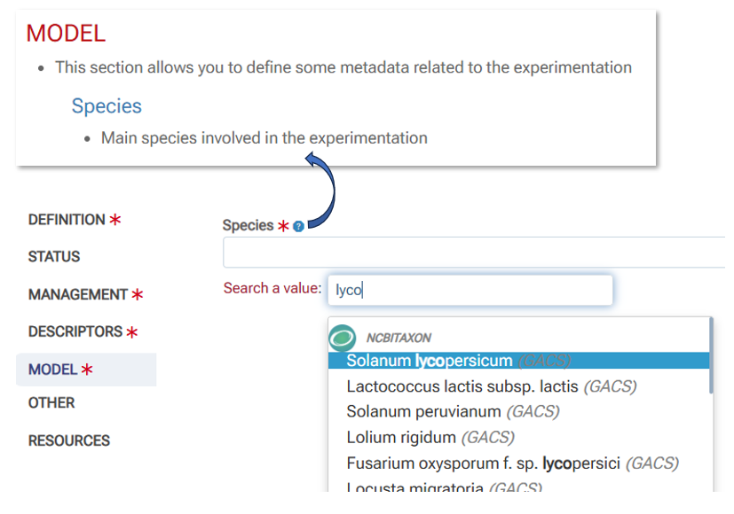

# Configuration

### Terminology configuration

A single file (***web/conf/config_terms.txt***) contains all the [terminology](../definitions/terminology/). The input and search interfaces are completely generated from this definition file, thus defining each of the fields, their input type (*checkbox*, *dropbox*, *textbox*, ...) and the associated controlled vocabulary (ontology and thesaurus by autocompletion, drop-down list according to a list of fixed terms). Internally, this file is converted to JSON format which is more suitable for use by the various modules, and in particular the creation of the [MongoDB][1]{:target="_blank"} database schema when starting the application before filling it. A second file (***web/conf/config_docs.txt***) is used to document the terminology and its content is therefore closely linked to the previous file.

There are two main ways to update these two files (TSV format) on the server.

 

#### Update from external files

In this approach, you edit the two terminology files yourself in your favorite spreadsheet (**1** & **2**), then you drop the two files on the disk space of the server where the Maggot application is installed (**3**), and finally you restart the application (**4**) so that the conversions and the generation of additional files can integrate the updates. The following schema illustrates the process :

 

#### Update from the web interface

In this approach, both terminology files are updated directly from Maggot's web interface. The following schema illustrates the process:

 

First, you select an existing section or define one to create, as well as a field to modify or create. Then an entry form guides you through the definition of the field to be added or updated. Once the field is fully defined, you update the terminology definition file by validating the entry. This also modifies the terminology documentation file accordingly. (**1**). The figure below shows an example of a new section creation along with a new field. 

 

The next step is to entry a description for each newly created field and/or section (**2**). The figure below shows an example of documentation of the new section along with its field. Selecting the section alone without the field allows you to document it. Selecting a field also allows you to document it.

 

Finally you restart the application (**3**) so that the conversions and the generation of additional files can integrate the updates. Below, the input interface with its new section and associated field, as well as the corresponding documentation. 

 

**Note** : Both functions to create / update the terminilogy files (definition & documentation) require to have **_admin privileges_**. See **_passwd_** in the [Commands](../installation/#commands) paragraph in the installation section.

 

*[TSV]: Open text format representing tabular data as "Tab-Separated Values". Each row corresponds to a table row and the cells in a row are separated by a tab
*[JSON]: JavaScript Object Notation : format used to represent structured information
*[autocompletion]: feature in which an application predicts the rest of a word a user is typing
*[JSON-Schema]: vocabulary that allows you to annotate and validate JSON documents.
*[Markdown]: a lightweight markup language designed to provide easy-to-read and easy-to-write syntax. A Markdown document can be read as is without appearing to have been marked up or formatted with special instructions.

[1]: https://www.mongodb.com/basics