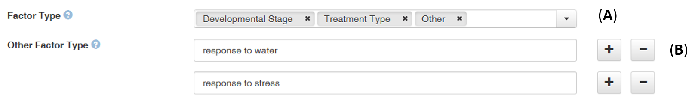

# Dataverse Definition File

Open source research data repository software, [approved by Europe][4]{:target="_blank"}.

### Dataverse definition File

This definition file will allow Maggot to automatically export the dataset into a data repository based on [Dataverse][1]{:target="_blank"}. The approach consists of starting from the Maggot metadata file in JSON format and transforming it into another JSON format compatible with Dataverse, knowing that this metadata crosswalk was made possible by choosing the right metadata schema at upstream.

The structure of the [Dataverse JSON][2]{:target="_blank"} output file being known internally, a minimum of information is therefore necessary to carry out the correspondence.

The file must have 4 columns + one optional with headers defined as follows:

* column 1 - **Field** : Shortname of the Maggot fields
* column 2 - **Typename** : The corresponding Dataverse fields. 
* column 3 - **Type** :The Dataverse field at the top level encapsulating the fields in the “Typename” column where applicable
* column 4 - **Terminology** : Indicates from which vocabulary the mapping should be performed. Concerning the vocabulary to be mapped either ***i)*** on a dictionary, you must put the name of the corresponding [dictionary](../../dictionaries) prefixed with ***cvlist:***, or ***ii)*** on ontologies or on a thesaurus, you must specify the corresponding entry in the [mapping definition file](../mapping) prefixing it with ***cv:***.
* column 5 - **Block** (_optional_): Name of the metadata block. Currently, only two blocks are support, namely the _common metadata_ block called **_citation_**., the _life science_ metadata block called **_biomedical_**. This column is optional but in this case, this assumes that all metadata correspond to the common metadata block (_citation_). See the [structure of the metadata blocks][5]{:target="_blank"} in JSON format.

Below an example of Dataverse definition file (TSV)

 

Example of Dataverse JSON file generated based on the definition file itself given as an example above.

   * [Dataverse JSON of the FRIM dataset][3]{:target="_blank"}

### Common metadata block (_citation_)

* List of **_Typename_** (column 2) supported by Maggot. Be careful of character case. See [the structure of the common metadata blocks][6]{:target="_blank"} in JSON format.

Typename     | Decription       | Type | Terminology | Linked to a CV | Required
------------ | -----------------|------|------------|---------------|--------------
title |  The main title of the Dataset | - | - | No | Yes
subject | The area of study relevant to the Dataset | - | - | Yes ^(1)^ | Yes
dsDescription | A summary describing the purpose, nature, and scope of the Dataset | - | - | No | Yes
note | Additional information about the Dataset | - | - | No | No
language | A language that the Dataset's files is written in | - | - | Yes ^(1)^ | No
license | License of the dataset | - | - | Yes ^(1)^| No
contacts | The entity, e.g. a person or organization, that users of the Dataset can contact with questions | - |  must specified a dictionary (e.g. cvlist:people) | No | Yes
author | The entity, e.g. a person or organization, that created the Dataset | - |  must specified a dictionary (e.g. cvlist:people) | No | Yes
collectors | people who participated in the data collection | must be equal to _contributor_ |  must specified a dictionary (e.g. cvlist:people) | No | No
curators | people who participated in the data curation | must be equal to _contributor_ |  must specified a dictionary (e.g. cvlist:people) | No | No 
members | people involved in the project | must be equal to _contributor_ |  must specified a dictionary (e.g. cvlist:people) | No | No
leaders | leaders of the projet | must be equal to _contributor_ |  must specified a dictionary (e.g. cvlist:people) | No | No
wpleader | leader of a WP projct | must be equal to _contributor_ |  must specified a dictionary (e.g. cvlist:people) | No | No
depositor | Depositor of the dataset | - |  - | No | No
producer | The entity, such a person or organization, managing the finances or other administrative processes involved in the creation of the Dataset | - |  must specified a dictionary (e.g. cvlist:producer) | No | No
grantNumbers | Information about the Dataset's financial support | - |  must specified a dictionary (e.g. cvlist:grant) | No | No
keyword | A key term that describes an important aspect of the Dataset and information about any controlled vocabulary used | - | must be specified an ontology (e.g. cv:bponto) | No | No
topics | Indicates a broad, important topic or subject that the Dataset covers and information about any controlled vocabulary used | - | must be specified an ontology (e.g. cv:bponto) | No | No
kindOfData | The type of data included in the files (e.g. survey data, clinical data, or machine-readable text) | - | - | Yes ^(1)^ | Yes
dataOrigin | Data Origin | - | - | Yes ^(1)^ | No
lifeCycleStep | Specifies the event happening over the data life cycle that is considered significant enough to document. | - | - | Yes ^(1)^ | No
publication_citation | The full bibliographic citation for the related publication | must be equal to _publication_ | - | No | No
publication_idtype | The type of identifier that uniquely identifies a related publication | must be equal to _publication_ | - | Yes ^(1)^ | No
publication_idnumber | The identifier for a related publication | must be equal to _publication_ | - | No | No
publication_url | The URL form of the identifier entered in the Identifier field, e.g. the DOI URL if a DOI was entered in the Identifier field. | must be equal to _publication_ | - | No | No

^(1)^ The list of CV terms must be defined either in the _Predefined terms_ column in the terminology definition file or in a javascipt. See [vocabulary](../vocabulary/) (points 1 & 3).

### Life science metadata block (_biomedical_)

* List of **_Typename_** (column 2) supported by Maggot. Be careful of character case. See [the structure of the life science metadata blocks][7]{:target="_blank"} in JSON format.

Typename     | Decription       | Type | Terminology | Linked to a CV | Required
------------ | -----------------|------|------------|---------------|--------------
Organism | The taxonomic name of the organism used in the Dataset or from which the  starting biological material derives. | - | - | Yes | No
DesignType | Design types that are based on the overall experimental design. | - | - | Yes | No
FactorType | Factors used in the Dataset. | - | - | Yes | No
MeasurementType | A term to qualify the endpoint, or what is being measured (e.g. gene expression profiling; protein identification). | - | - | Yes | No
TechnologyType | A term to identify the technology used to perform the measurement (e.g. DNA microarray; mass spectrometry). | - | - | Yes | No
Platform | The manufacturer and name of the technology platform used in the assay (e.g. Bruker AVANCE). | - | - | Yes | No
CellType | The name of the cell line from which the source or sample derives. | - | - | No | No
SampleType | Sample description | - | - | No | No
ProtocleType | Protocole type| - | - | No | No

**Point of attention** : In the _Life Sciences_ metadata block, there are two ways to populate certain metadata (organism, study design, factor, measurement type, technology type, platform): either with a [predefined CV][8]{:target="_blank"} (**A**), or with user-defined terms (**B**) as shown in the figure below:

 

Since Maggot only allows one vocabulary source (e.g., a dictionary) per metadata field, the data manager must therefore add the most relevant predefined CV to each appropriate dictionary (**a**). Then, during the transfer to Dataverse, a sorting mechanism between the two types of vocabularies (predefined vocabularies and others) ensures that the fields of the Dataverse metadata record are correctly populated (**b**).

 
The figure below shows an example as an illustration:

 

  

[1]: https://dataverse.org/
[2]: https://guides.dataverse.org/en/latest/api/native-api.html#import-a-dataset-into-a-dataverse-collection
[3]: https://pmb-bordeaux.fr/maggot/metadata/frim1?format=dataverse
[4]: https://open-research-europe.ec.europa.eu/for-authors/data-guidelines#approvedrepositories
[5]: https://demo.recherche.data.gouv.fr/api/metadatablocks
[6]: https://demo.recherche.data.gouv.fr/api/metadatablocks/citation
[7]: https://demo.recherche.data.gouv.fr/api/metadatablocks/biomedical
[8]: https://pmb-bordeaux.fr/maggot/check?biomedicalCV

