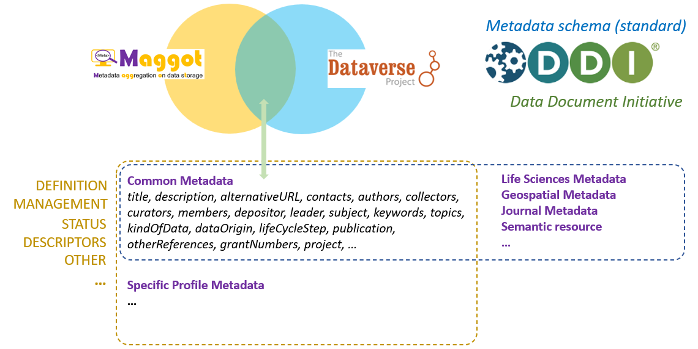
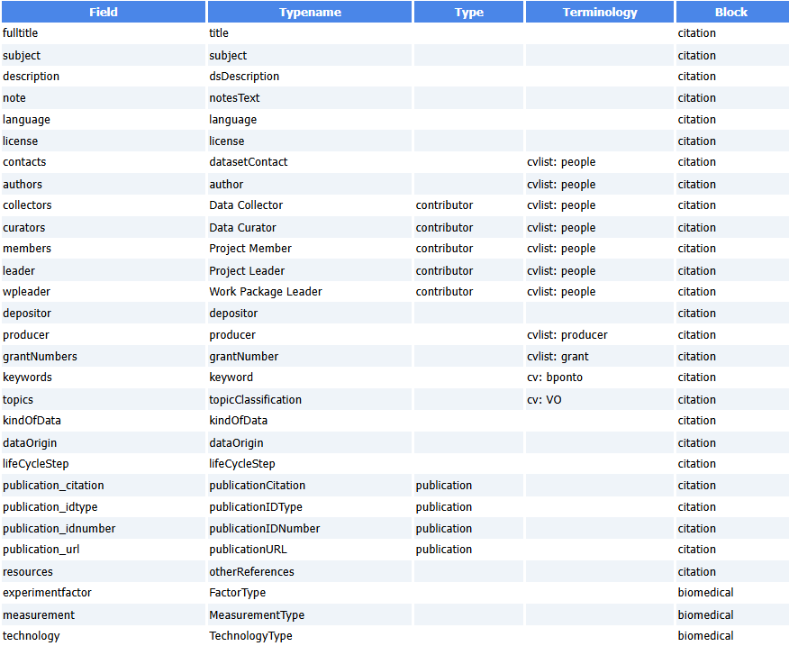

# Dataverse Definition File

Open source research data repository software, [approved by Europe][4]{:target="_blank"}.

### Dataverse definition File

This definition file will allow Maggot to automatically export the dataset into a data repository based on [Dataverse][1]{:target="_blank"}. The approach consists of starting from the Maggot metadata file in JSON format and transforming it into another JSON format compatible with Dataverse, knowing that this metadata crosswalk was made possible by choosing the right metadata schema at upstream.

The structure of the [Dataverse JSON][2]{:target="_blank"} output file being known internally, a minimum of information is therefore necessary to carry out the correspondence.

The file must have 4 columns with headers defined as follows:

* column 1 - **Field** : shortname of the Maggot fields
* column 2 - **Typename** : The corresponding Dataverse fields. 
* column 3 - **Type** :The Dataverse field at the top level encapsulating the fields in the “Typename” column where applicable
* column 4 - **Terminology** : Indicates from which vocabulary the mapping should be performed. Concerning the vocabulary to be mapped either ***i)*** on a dictionary, you must put the name of the corresponding [dictionary](../../dictionaries) prefixed with ***cvlist:***, or ***ii)*** on ontologies or on a thesaurus, you must specify the corresponding entry in the [mapping definition file](../mapping) prefixing it with ***cv:***.

Below an example of Dataverse definition file (TSV)

 

Example of Dataverse JSON file generated based on the definition file itself given as an example above.

   * [Dataverse JSON of the FRIM dataset][3]{:target="_blank"}

  

[1]: https://dataverse.org/
[2]: https://guides.dataverse.org/en/latest/api/native-api.html#import-a-dataset-into-a-dataverse-collection
[3]: https://pmb-bordeaux.fr/maggot/metadata/frim1?format=dataverse
[4]: https://open-research-europe.ec.europa.eu/for-authors/data-guidelines#approvedrepositories