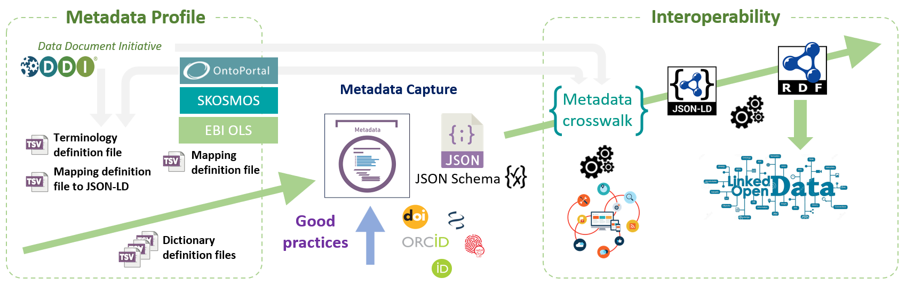

# JSON-LD Definition File

### JSON-LD definition File

This definition file will allow harvesters to collect structured metadata based on a semantic schema, i.e the fields themselves and not just their content can be associated with a semantic definition (ontology for example) which will then facilitate the link between the metadata and therefore the data ([JSON-LD][1]{:target="_blank"}). The chosen semantic schema is based on several metadata schemas.

The full workflow to "climb the Link Open Data mountain" is resumed by the figure below :

Metadata schemas used to build the model proposed by default:

   * [Schema.org][2]{:target="_blank"}, [Bioschemas.org][3]{:target="_blank"}, [Datacite][4]{:target="_blank"}, [DDI-RDF][5]{:target="_blank"}, [DubinCore][6]{:target="_blank"}, [Dataverse][7]{:target="_blank"}

Definition of the [JSON-LD context][9]{:target="_blank"} using the metadata schemas proposed by default

The structure of the JSON-LD is not known internally, information on the structure will therefore be necessary to carry out the correspondence.

Example of JSON-LD definition file (partial) using the metadata schemas proposed by default (TSV)

Example of JSON-LD file generated based on the definition file itself given as an example above.

   * [JSON-LD file of the FRIM dataset][8]{:target="_blank"}

  

[1]: https://en.wikipedia.org/wiki/JSON-LD
[2]: https://schema.org/Dataset
[3]: https://bioschemas.org/profiles/Dataset/1.0-RELEASE
[4]: https://support.datacite.org/docs/datacite-metadata-schema-44
[5]: https://rdf-vocabulary.ddialliance.org/discovery.html
[6]: https://www.dublincore.org/specifications/dublin-core/dcmi-terms/
[7]: https://docs.google.com/spreadsheets/d/13HP-jI_cwLDHBetn9UKTREPJ_F4iHdAvhjmlvmYdSSw/edit#gid=0
[8]: https://pmb-bordeaux.fr/maggot/metadata/frim1?format=jsonld
[9]: https://niem.github.io/json/reference/json-ld/context/
