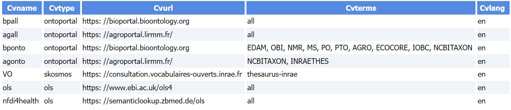

# Mapping Definition File

### Mapping definition File

**The mapping file** (**_mapping.txt_**) is used as indicated by its name to match a term chosen by the user during entry with another term from an ontology or a thesaurus and therefore to obtain a URL which will be used for referencing. It can be used for each [metadata crosswalk][1]{:target="_blank"} requiring such a mapping (e.g. to the [Dataverse](../dataverse), [Zenodo](../zenodo) or [JSON-LD](../json-ld) format).

The role of this definition file is illustrated with the figure above

 

The file must have ***5 columns*** with headers defined as follows:

   * column 1 - **CVname** : name of the mapping entry
   * column 2 - **CVtype** : type of the CV target (by default, must be either *ontoportal*, *skosmos* or *ols*)
   * column 3 - **CVurl** : URL of the corresponding web API
   * column 4 - **CVterm** : name of the thesaurus or the ontology list separated by a comma
   * column 5 - **CVlang** : the chosen language (mainly for thesauri)

Note that a corresponding *<CVtype\>.inc* file must be located under *web/inc/mapping*.
 

Below an example of Mapping definition file (TSV)

 

[1]: https://www.google.com/search?q=metadata+crosswalk+definition&oq=metadata+crosswalk