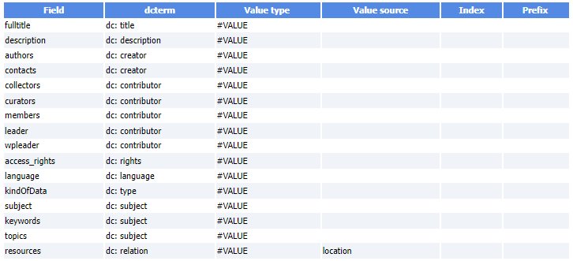

# OAI-PMH Definition File

[OAI-PMH][1]{:target="_blank"} is a protocol developed for [harvesting metadata][6]{:target="_blank"} descriptions of records in an archive so that services can be built using metadata from many archives.

### OAI-PMH definition File

This definition file will allow harvesters to collect metadata structured according to a standard schema ([OAI-DC][5]{:target="_blank"}).

   * Based on the [Open Archives Initiative Protocol for Metadata Harvesting][1]{:target="_blank"} - [Version 2][2]{:target="_blank"}

   * Example of a [OAI-PMH Data Provider Validation][4]{:target="_blank"}

   * Example of OAI-PMH output for a dataset
       * [FRIM dataset][3]{:target="_blank"}

The structure of the OAI-PMH output file being known internally, a minimum of information is therefore necessary to carry out the correspondence.

Example of OAI-PMH definition file (TSV)

Another example of OAI-PMH definition file (TSV) with identifers & vocabulary mapping

  

[1]: https://en.wikipedia.org/wiki/Open_Archives_Initiative_Protocol_for_Metadata_Harvesting
[2]: https://www.openarchives.org/OAI/openarchivesprotocol.html
[3]: https://pmb-bordeaux.fr/maggot/oai?verb=GetRecord&metadataPrefix=oai_dc&identifier=oai:pmb-bordeaux.fr::frim1
[4]: ../../pdf/MAGGOT_OAI-PMH_Validation_Oct2023.pdf
[5]: https://guidelines.openaire.eu/en/latest/literature/use_of_oai_dc.html
[6]: https://en.wikipedia.org/wiki/Metadata_discovery
