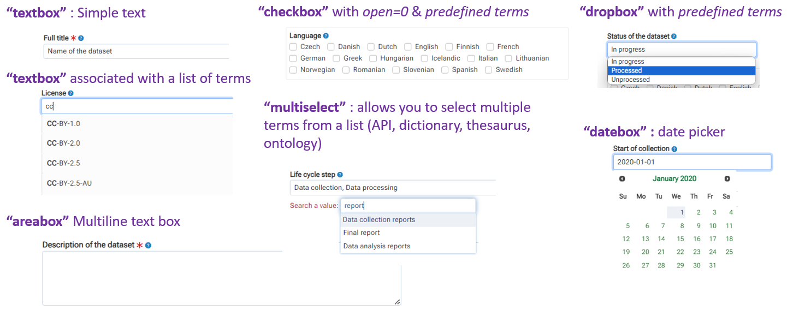

# Terminology

### Definition of terminology

There are two definition files to set up.

* **The terminology definition file** (**_config_terms.txt_**) serving to describe all terminology used to define the metadata of a dataset.
* **The terminology documentation file** (**_config_doc.txt_**) serving to documente all terminology definitions.

Each time there is a change in these two definition files, it is necessary to [convert](../../configuration) them so that they are taken into account by the application.

Terminology is the set of terms used to define the metadata of a dataset. A single file (**_web/conf/config_terms.txt_**) contains all the terminology. The input and search interfaces (e.g <a href="../../images/entry_fig2.png" data-lightbox="fig5">screenshot</a>) are completely generated from this definition file, thus defining ***i)*** each of the fields, their input type (checkbox, dropbox, textbox, ...) and ***ii)*** the associated controlled vocabulary (ontology and thesaurus by autocompletion, drop-down list according to a list of fixed terms).

The [metadata schema][4]{:target="_blank"} proposed by defaut is mainly established according to the [DDI][5]{:target="_blank"} (Data Documentation Initiative) schema that also corresponds to that adopted by the [Dataverse][6]{:target="_blank"} software.

Terminology is organised in several sections. By default 6 sections are proposed, but you can redefine them as you wish:

- ***DEFINITION*** : Section for describing shortly the dataset. 
- ***STATUS*** : Section for defining the status of the dataset, associated rights, dates, etc.
- ***MANAGEMENT*** : Section for assigning names of people or organizations who participated in the production of data and according to the type of participation.
- ***DESCRIPTORS*** : Section for defining elements characterizing the data themselves and certain experimental conditions for obtaining them.
- ***OTHER*** : Section for entering miscellious information (protocols, comments, issues, ...)
- ***RESOURCES*** : Section for defining metadata about all the resources you want, i.e both external (links) and internal (data files on the storage space) resources. This section does not require any configuration _a priori_, it is added _de facto_.

For each section, fields are then defined. These fields can be defined according to the way they will be entered via the web interface. There are **6 different types of input**: check boxes (**_checkbox_**), drop lists (**_dropbox_**), single-line text boxes (**_textbox_**), single-line text boxes with an additional box for multiple selection from a catalog of terms (**_multiselect_**), date picker (**datebox**) and multi-line text boxes (**_areabox_**).

For two types (**_checkbox_** and **_dropbox_**), it is possible to define the values to be selected (predefined terms).

 

#### Structure of the Terminology definition file (TSV)

The file must have 9 columns with headers defined as follows:

* column 1 - **Field** : shortname of the fields
* column 2 - **Section** : shortname ot the sections
* column 3 - **Required** : indicates if the field is mandatory ('Y') or not ('N')
* column 4 - **Search** : indicates if the field can be used as a criterion search ('Y') or not ('N')
* column 5 - **Shortview** : indicates with ordered numbers if the field serves for the overview table after the search (empty by default)
* column 6 - **Type** : indicates the way they will be entered via the web interface (possible values are: **_textbox_**, **_dropbox_**, **_checkbox_**, **_multiselect_**, **_datebox_** and **_areabox_**).
* column 7 - **Features** : dependings on the Type value, one can specifiy some specific features. If several features, they must be separated by a comma.
     * **open=0** or **open=1** (***checkbox***) :  indicates if the selection is opened or not. See [Vocabulary](../vocabulary).
     * **autocomplete=_entity_** (***textbox***, ***checkbox*** & ***multiselect***) :  The *entity.js* file must be present under ***web/cvlist/entity/*** if the entity is a dictionary otherwise it must be present under *[web/js/autocomplete][1]{:target="_blank"}*. See [Vocabulary](../vocabulary).
     * **ws=_web_service name_** (***multiselect***) : indicates the web service name, e.g *VO*, *ols*, *agroportal* or *bioportal*. Attribute available only if the API call for the vocabulary is based on the [Twitter's Typeahead library][7]{:target="_blank"}. In this case, the autocomplete attribute must be equal to *typeahead*. See [Vocabulary](../vocabulary).
     * **onto=_ontology list/thesaurus name_** (***multiselect***) : indicates the ontology list, e.g. for a web service based on [OntoPortal][9] or the thesaurus name, e.g. for a web service based on [SKOSMOS][8]. In case of an ontology list, the separator (_:_) must a colon with no space (eg. _OBI:EFO:PO:ENVO_). Attribute available only if the API call for the vocabulary is based on the [Twitter's Typeahead library][7]{:target="_blank"}. In this case, the autocomplete attribute must be equal to *typeahead*. See [Vocabulary](../vocabulary).
     * **width=_NNNpx_** (***textbox***, ***dropbox***, ***datebox***) : allows you to specify the width of the box. Usefull if you want put several fields in the same line. See note 1 below.
     * **row=_NN_** and **cols=_NN_** (***areabox***) : allows you to specify the row and column size of the textarea.
* column 8 - **Label** : Labels corresponding to the fields that will appear in the web interface
* column 9 - **Predefined terms** : for fields defined with a type equal to ***checkbox*** or ***dropbox***, one can give a list of terms separated by a comma.

* **Notes**

    * the fields will be displayed in the same order as in the file and by section. So if you want to specify several textboxes with particular sizes so that they are on the same line, they should belong to the same section and follow each other in the file in the same order.
    * the ***title*** and ***description*** fields are mandatory but not necessarily in the same section.

Below an example of Terminology definition file (TSV)

 

Example of Maggot JSON file generated based on the same definition file

* [Maggot JSON of the FRIM dataset][2]{:target="_blank"} and its corresponding [JSON-schema][3]{:target="_blank"}

 

#### Structure of the Terminology documentation file (TSV)

The documentation definition file is used to have online help for each field (small icon placed next to each label on the form). So it should only be modified when a field is added or deleted, or moved to another section. This file will be used then to generate the online metadata documentation according to the figure below (See [Configuration](../../configuration) to find out how to carry out this transformation).

The file must have 3 columns with headers defined as follows:

* column 1 - **Type** : The type of the element, namely 'section', 'field' or 'option'. An 'option' type must correspond to each of the options for a field corresponding to a drop-down list.
* column 2 - **Name** : Name of the element. The names of the sections, variables and drop-down options must be exactly the same as those specified in the terminology definition file.
* column 3 - **Description** : The description corresponding to the element, serving as much as possible to give indications on the information to be selected or entered, in order to remove possible ambiguities.

Below an example of Terminology documentation file (TSV)

 

Same example as above converted to HTML format using Markdown format

* [Metadata Documentation](https://pmb-bordeaux.fr/maggot/doc/meta){:target="_blank"}

 

*[TSV]: Open text format representing tabular data as "Tab-Separated Values". Each row corresponds to a table row and the cells in a row are separated by a tab
*[JSON]: JavaScript Object Notation : format used to represent structured information
*[autocompletion]: feature in which an application predicts the rest of a word a user is typing
*[JSON-Schema]: vocabulary that allows you to annotate and validate JSON documents.
*[Markdown]: a lightweight markup language designed to provide easy-to-read and easy-to-write syntax. A Markdown document can be read as is without appearing to have been marked up or formatted with special instructions.

[1]: https://github.com/inrae/pgd-mmdt/blob/main/web/js/autocomplete/
[2]: https://pmb-bordeaux.fr/maggot/metadata/frim1?format=maggot
[3]: https://pmb-bordeaux.fr/maggot/conf/maggot-schema.json
[4]: https://en.wikipedia.org/wiki/Metadata_standard
[5]: https://ddialliance.org/
[6]: https://ddialliance.org/project/the-dataverse-project
[7]: https://twitter.github.io/typeahead.js/
[8]: https://skosmos.org/
[9]: https://ontoportal.org/

