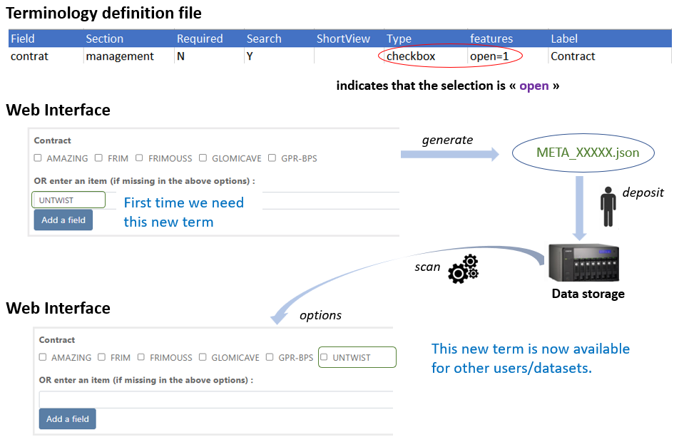
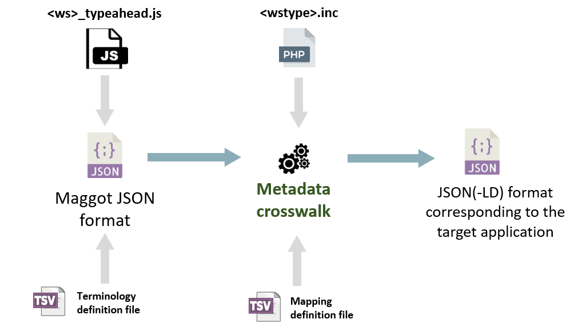
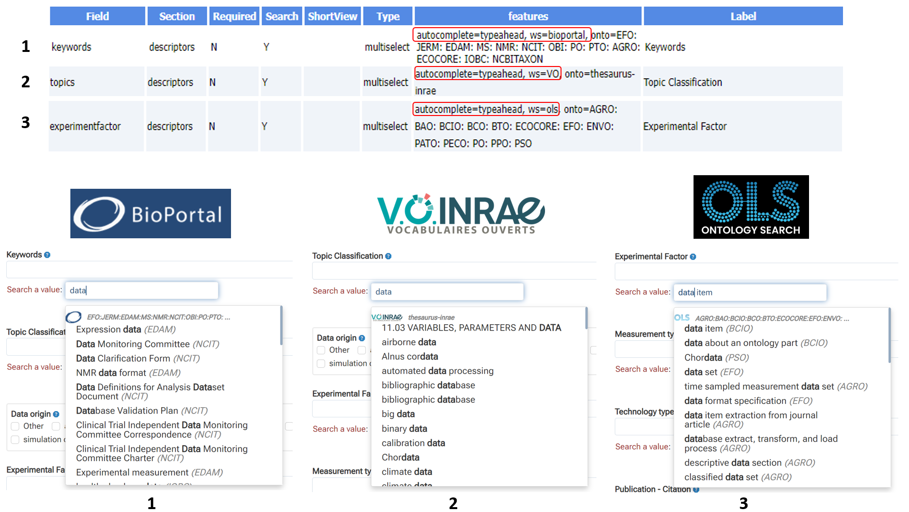
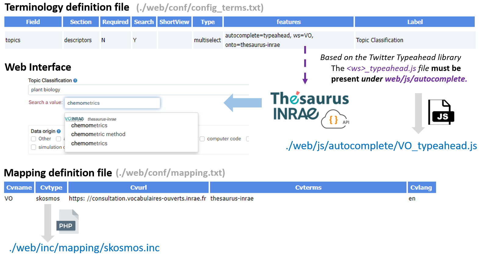

# Vocabulary

### Vocabulary

* In this section we expose the full extent of the possibilities concerning the vocabulary in Maggot.
* Choosing the type of vocabulary and how to enter it depends entirely on what you put in the [terminology definition file](../terminology). However, some approaches require a little technicality by writing small scripts based on [JavaScript][13]{:target="_blank"}, but nothing too serious. You can always take an already ready-made script and modify only the part that concerns your focus.

 

**1** -  **Vocabulary based on a list of terms fixed in advance** (*checbox with feature open=0*)

* List of well-chosen and limited Control Vocabulary e.g according to a reference e.g. Data Document Initiative.

 

**2** - **Vocabulary open for addition** (*checkbox with feature open=1*)

* allows you to collect the desired _Control Vocabulary_ (CV) from users. In order to initiate the list, you can put some terms in the _predefined terms_ column of the terminology definition file.

 

**3** - **Vocabulary based on a web API in a text field** (*textbox*)

* The [web API][1]{:target="_blank"} is defined in a [JavaScript][13]{:target="_blank"} file with the same name as the assigned variable (here *cities*) and must present under *web/js/autocomplete*. For example, to enter a French city you can use the API [geo.api.gouv.fr][3]{:target="_blank"}. See [cities.js][4]{:target="_blank"}

 

**4** - **Vocabulary based on a dictionary with multiple selection** (*multiselect*) 

* [Dictionaries](../../dictionaries) allow you to record multiple information necessary to define an entity, such as the names of people or even the funders. These information, once entered and saved in a file called a dictionary. Based on a very simple JavaScript retrieving the complete list of items included in the dictionary, thus creating a sort of internal API, we can fill a Maggot field by  autocompletion related to a search for these items.
* The JavaScript file must be named _**dico.js**_ and be present under _**web/cvlist/_dico_/**_ where _**dico**_ is the name of the dictionary. See for instance _[people.js][5]{:target="_blank"}_

 

**5** - **Multi-select vocabulary, based on an API managed by Twitter's Typeahead library.** (*multiselect*) 

* Maggot embeds [Twitter's Typeahead library][16]{:target="_blank"} making it relatively easy for a data manager to implement a new vocabulary from its web API. With the help of this library, this allows users to select a term from a list of vocabulary terms within a drop-down list. The list of terms has been pre-selected based on the first letters entered in the “Search for value” box. This list is dynamically refreshed when letters are added or modified. So, unlike a single call to the API returning the entire list of terms in memory, which can take a very long time to load, the calls are made dynamically on the basis of a portion of a word (3 letters minimum by default), limiting the number of terms to retrieve. Thus this makes use very fluid.

* To implement an API-based web service, it is necessary to create two scripts (*<ws\>_typeahead.js* and *<wstype\>.inc*) which will each be used at one stage of the process as shown in the following figure:

1. *<ws\>_typeahead.js* : This file corresponds to the API call when entering vocabulary using Twitter's Typeahead library. The prefix *<ws\>* standing for web service, must be positioned so as to correspond to the name of the service indicated in the *CVname* column of the mapping file (see [mapping](../mapping)) as well as to the corresponding value for the '*ws*' attribute in the column '*features*' of the terminology definition file (see [definitions](../terminology)). This file must then be placed under the *web/js/autocomplete* directory. You will find a [template file][17]{:target="_blank"} in this directory.

2. *<wstype\>.inc* : This file corresponds to the API call while metadata crosswalks processus and based on the mapping file ([*web/conf/mapping.txt*](../mapping)).The prefix *<wstype\>* standing for web service type, must be positioned so as to correspond to the type of the service indicated in the *CVtype* column of the mapping file. This file must then be placed under the *web/inc/mapping/* directory. You will find a [template file][18]{:target="_blank"} in this directory.

 

* By defaut, Maggot already provides some vocaburay web services implemented in this way such as the ontology portals based on [OntoPortal][19]{:target="_blank"}, the [SKOSMOS][6]{:target="_blank"} thesauri and the [EMBL-EBI Ontology Lookup Service][20]{:target="_blank"}. The figure below shows the configuration in the terminology definition file and the corresponding screenshots for each vocabulary.

1. [AgroPortal][22]{:target="_blank"} and [BioPortal][23]{:target="_blank"} are both based on [OntoPortal][19]{:target="_blank"} which is a generic technology to build ontology repositories or semantic artefact catalogues.

2. [SKOSMOS][6]{:target="_blank"} is a web tool facilitating the posting of controlled vocabulary online in the form of a [thesaurus][9]{:target="_blank"} according to the [SKOS][8]{:target="_blank"} data model. It offers a navigation interface as well as a web API.

3. [EMBL-EBI Ontology Lookup Service][20]{:target="_blank"} is a repository for biomedical ontologies that aims to provide a single point of access to the latest ontology versions. You can browse the ontologies through the website as well as programmatically via the OLS API.

Note: we also support the [Terminology Service for NFDI4Health][26]{:target="_blank"} given that it is also based on OLS.

 

* Here is, for example, the implementation of the [INRAE Thesaurus][21]{:target="_blank"}, a web service based on [SKOSMOS][6]{:target="_blank"}. The figure below shows in more details how to fill in the definition files linked to the two scripts necessary for implementing the web service :

 

* Links to the two scripts :

    * [web/js/autocomplete/VO_typeahead.js][24]{:target="_blank"}
	* [web/inc/mapping/skosmos.inc][25]{:target="_blank"}

*[API]: Application Program Interface in contrast with a User Interface. It is a way for two or more computer programs to communicate with each other. 

[1]: https://en.wikipedia.org/wiki/Web_API
[2]: https://en.wikipedia.org/wiki/Autocomplete
[3]: https://geo.api.gouv.fr/decoupage-administratif
[4]: https://github.com/inrae/pgd-mmdt/blob/main/web/js/autocomplete/cities.js
[5]: https://github.com/inrae/pgd-mmdt/tree/main/web/cvlist/people/people.js
[6]: https://skosmos.org/
[7]: https://ontoportal.org/
[8]: https://en.wikipedia.org/wiki/Simple_Knowledge_Organization_System
[9]: https://en.wikipedia.org/wiki/Thesaurus_(information_retrieval)
[10]: https://github.com/inrae/pgd-mmdt/blob/main/web/js/autocomplete/VOvocab.js
[11]: https://bioportal.bioontology.org/
[12]: https://agroportal.lirmm.fr/
[13]: https://en.wikipedia.org/wiki/JavaScript
[14]: https://bioportal.bioontology.org/ontologies/STY?p=widgets
[15]: https://github.com/inrae/pgd-mmdt/blob/main/web/js/bpsearch.min.js
[16]: https://github.com/twitter/typeahead.js/blob/master/doc/jquery_typeahead.md
[17]: https://github.com/inrae/pgd-mmdt/blob/main/web/js/autocomplete/template_typeahead.js
[18]: https://github.com/inrae/pgd-mmdt/blob/main/web/inc/mapping/template.inc
[19]: https://ontoportal.org/
[20]: https://www.ebi.ac.uk/ols4
[21]: https://thesaurus.inrae.fr/thesaurus-inrae/en/
[22]: https://agroportal.lirmm.fr/
[23]: https://bioportal.bioontology.org/
[24]: https://github.com/inrae/pgd-mmdt/blob/main/web/js/autocomplete/VO_typeahead.js
[25]: https://github.com/inrae/pgd-mmdt/blob/main/web/inc/mapping/skosmos.inc
[26]: https://semanticlookup.zbmed.de/ols/index
