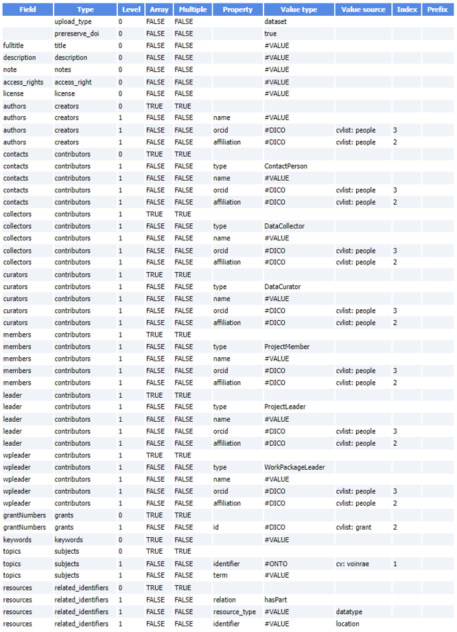

# Zenodo Definition File

Open source research data repository software, [approved by Europe][4]{:target="_blank"}.

### Zenodo definition File

This definition file will allow Maggot to automatically export the dataset into a data repository based on [Zenodo][1]{:target="_blank"}. The approach consists of starting from the Maggot metadata file in JSON format and transforming it into another JSON format compatible with Zenodo.

The structure of the [Zenodo JSON][2]{:target="_blank"} output file is not known internally, information on the structure will therefore be necessary to carry out the correspondence.

Below an example of Zenodo definition file (TSV)

 

Example of Zenodo JSON file generated based on the definition file itself given as an example above.

   * [Zenodo JSON of the FRIM dataset][3]{:target="_blank"}

  

[1]: https://www.openaire.eu/zenodo-guide
[2]: https://developers.zenodo.org/#rest-api
[3]: https://pmb-bordeaux.fr/maggot/metadata/frim1?format=zenodo
[4]: https://open-research-europe.ec.europa.eu/for-authors/data-guidelines#approvedrepositories