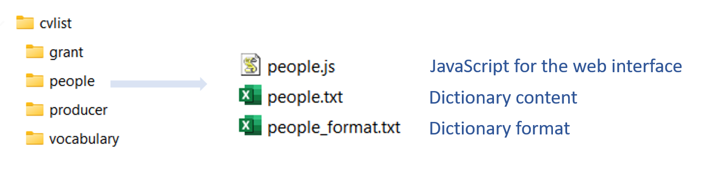
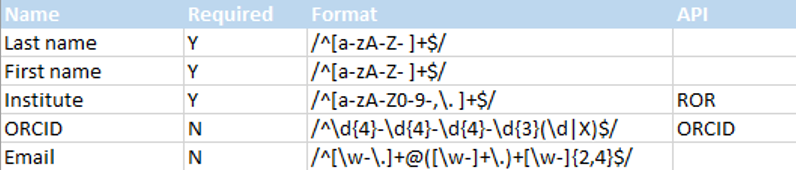
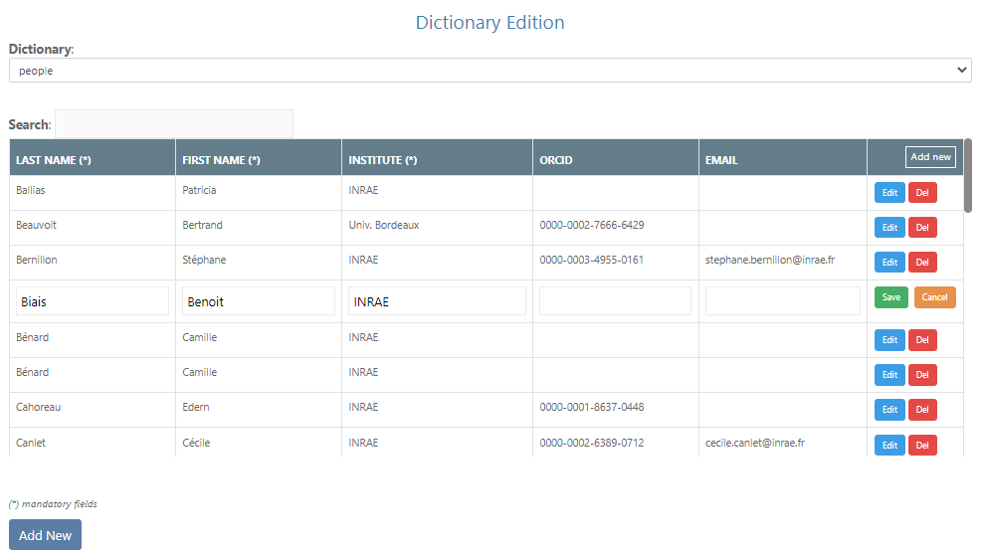
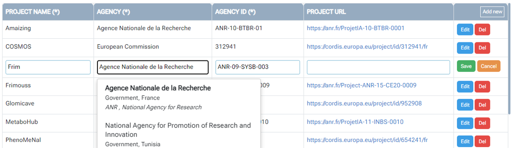
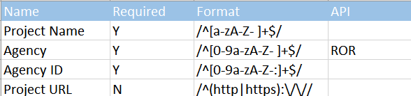
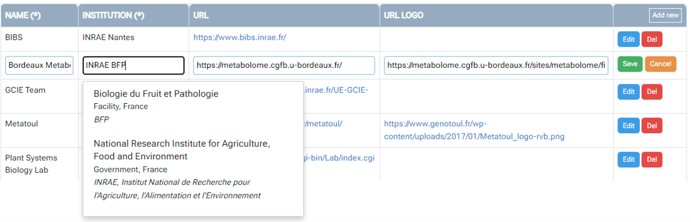
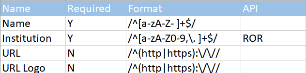
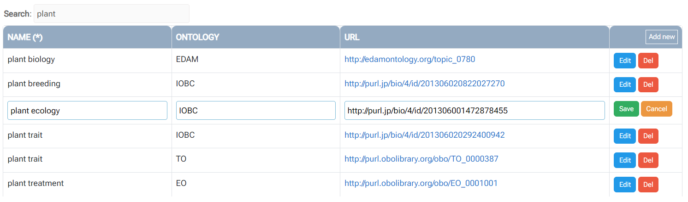
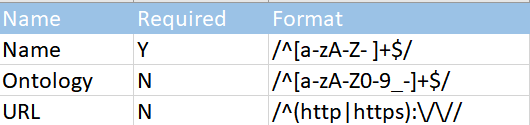

# Dictionaries

<style>.md-typeset h1 {display: none;} .md-nav__item {font-size: medium}</style>

### Presentation

* The use of dictionaries has no other purpose to facilitate the entry of metadata, entry which can be long and repetitive in generalist data warehouses (such as repository based on Dataverse).
* Dictionaries allow you to record multiple information necessary to define an entity, such as the names of people or even the funders. These information, once entered and saved in a file called a dictionary, can be subsequently associated with the corresponding entity. 
* The dictionaries offered by default are: people (***people***), funders (***grant***), data producers (***producer***), as well as a vocabulary dictionary (***vocabulary***) allowing you to mix ontologies and thesauri from several sources.
* To add a new dictionary, simply create a directory under *[web/cvlist][10]{:target="_blank"}* then putting the files corresponding to the dictionary inside. Dictionaries will be automatically found by browsing this directory.
* Dictionary files are made using a simple spreadsheet then exported in TSV format.
* Dictionaries are accessed through secure access limited to administrators allowing their editing. The login is by default '***admin***'. You can add another account for consultation only using the following command: 
```
sh ./run passwd <user>
```

<br>

#### The people dictionary
* **_Note_** : must not be changed in its format nor in its name.
* Like any dictionary, there must be 3 files (see below). Please note that the names of these files must always contain the name of the dictionary, i.e. same as the directory.
<center>
<a href="../images/dico0.png" data-lightbox="fig0"></a>
</center><br>

* The format of the file containing the dictionary data (*people.txt*) is defined by another file (*people_format.txt*).

<center>
<a href="../images/dico2.png" data-lightbox="fig2"></a>
</center><br>

* Thus, we know that the people dictionary must contain 5 columns (last name, first name, institution, [ORCID][5]{:target="_blank"} number and email address) and that some fields are mandatory (last name, first name, institution) and others optional (ORCID number, email address).
* Each of the fields must respect a format specified by a [regular expression][1]{:target="_blank"} in order to be accepted as valid.
* Optionally, you can connect an [web API][2]{:target="_blank"} to each of the fields in order to make an entry by autocompletion from a remote register. Currently only ROR ([Research Organization Registry][3]{:target="_blank"}) web API is possible but the mechanism is in place for new extensions.
* The third file, a very simple script written in [JavaScript][4]{:target="_blank"}, defines the way to retrieve the list of names (here by containing the first and last name). Note that the name of the variable must always be identical to that of the dictionary.
```js
var people = [];
// Each item in the 'people' list consists of the first two columns (0,1) separated by a space
get_dictionary_values('people', merge=[0,' ',1]) 
```
* Below, an example is given when modifying a record. When you click on the *Institute* field which is connected to the ROR web API, the drop-down list of reseach organizations that can correspond in the register appears, if there are any.
<center>
<a href="../images/dico1.png" data-lightbox="fig1"></a>
</center>

* **Note**: It is possible to edit dictionaries, by adding an entry for example, and at the same time be able to immediately find this new entry in the metadata entry in the Maggot tool. Indeed each dictionary is reloaded into memory as soon as the corresponding input box is clicked. See <a href="../images/dico6.png" data-lightbox="fig6">an illustration</a>.

<br>

#### Other dictionaries

* **Funders** : The dictionary of the funders allows you to define the funding agency, project ID and its corresponding URL.
<center>
<a href="../images/dico9.png" data-lightbox="fig9"></a>
</center><br>
    * **_Note_** : can be renamed but while keeping its format (same columns and same layout).
<center>
<a href="../images/dico3.png" data-lightbox="fig3"></a>
</center><br>

* **Producers** : The dictionary of the data producers allows you to define their Institute and  project ID and their corresponding URL. Optionally, you can add the URL of the logo.
<center>
<a href="../images/dico8.png" data-lightbox="fig8"></a>
</center><br>
    * **_Note_** : can be renamed but while keeping its format (same columns and same layout).
<center>
<a href="../images/dico4.png" data-lightbox="fig4"></a>
</center><br>

* **Vocabulary** : Use this dictionary for mixing thesauri and ontologies in order to better target the entire controlled vocabulary of its field of application. Only the vocabulary is mandatory, the URL linked to an ontology or a thesaurus is optional. See [Vocabulary](../definitions/vocabulary/) section to learn the extent of the possibilities concerning vocabulary in Maggot.
<center>
<a href="../images/dico7.png" data-lightbox="fig7"></a>
</center><br>


    * **_Note_** : can be duplicated but while keeping its format (same columns and same layout).
<center>
<a href="../images/dico5.png" data-lightbox="fig5"></a>
</center><br>

<br>

*[TSV]: Open text format representing tabular data as "Tab-Separated Values". Each row corresponds to a table row and the cells in a row are separated by a tab

[1]: https://www.w3schools.com/js/js_regexp.asp
[2]: https://en.wikipedia.org/wiki/Web_API
[3]: https://ror.org/
[4]: https://en.wikipedia.org/wiki/JavaScript
[5]: https://info.orcid.org/researchers/

[10]: https://github.com/inrae/pgd-mmdt/tree/main/web/cvlist