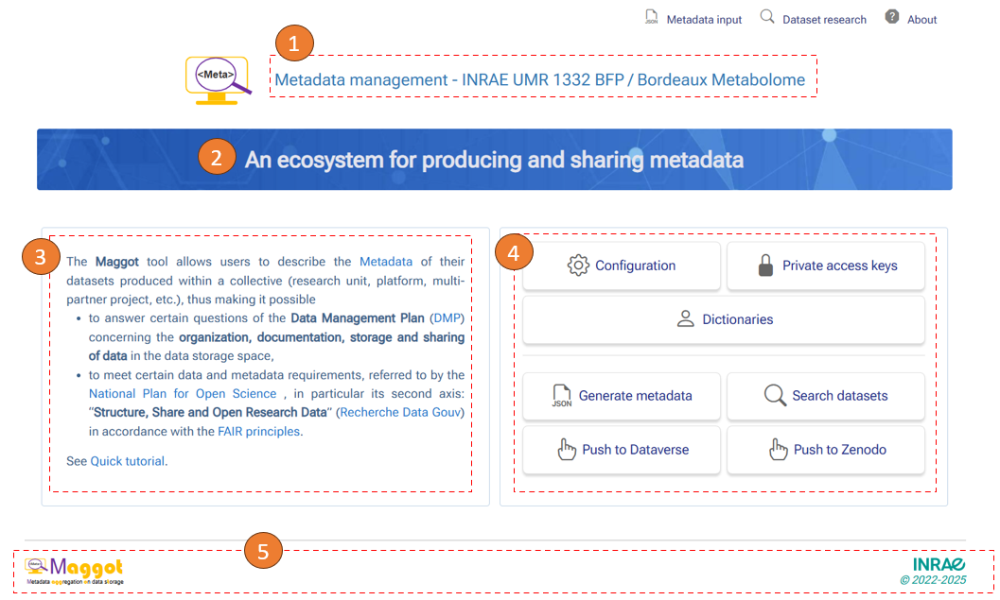
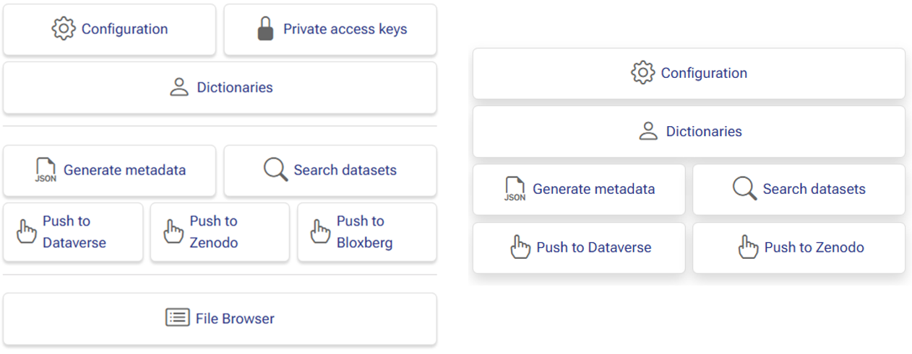

# Home page

<style>.md-typeset h1 {display: none;} .md-nav__item {font-size: medium}</style>

### Home page customization 

Since the [version 2.3][1]{target=_blank}, it is now more easy to customize the home page, depending on your site.  The figure below shows an example of a home page.

<center>
<a href="../images/home-page-0.png" data-lightbox="fig0"></a>
</center>

Each number on the figure indicates a part on which you can intervene :

__1__ - <ins>Main title</ins> is defined by the **_$TITLE_** variable in the configuration file (_web/inc/config/config.inc_),<br>
&nbsp;&nbsp;&nbsp;&nbsp;&nbsp;or better in the _web/inc/config/local.inc_ file.

__2__ - <ins>Message in the banner</ins> is defined by the  **_$BANNER_** variable in the _web/inc/home/home_left.inc_ file.

__3__ - <ins>Text on the left part</ins> is defined by the **_$HTMLTEXT_** variable in the _web/inc/home/home_left.inc_ file.

__4__ - <ins>Options and their arrangements</ins> are defined by the **_$OPTIONS_** variable in the _web/inc/home/home_right.inc_ file.<br>
&nbsp;&nbsp;&nbsp;&nbsp;&nbsp;See more details below.

__5__ - <ins>Logos and links</ins> at the bottom of the page are in the _web/inc/footer.inc_ file.

<br>

#### Options and their arrangements

The **_$OPTIONS_** variable in the _web/inc/home/home_right.inc_ file defines the options and their arrangements. It is an array of arrays, each sub-array corresponding to an option, as shown in the example below:

```php
$OPTIONS = [
	'option1' => [
		'active' => $CONFIGURATION,
		'label' => 'Configuration',
		'url' => 'viewconf',
		'icon' => 'gear', 
		'info' => '<b>Configure</b> the terminology definition file',
		'row' => 1
	],
	'option2' => [
		'active' => $PRIVATE_ACCESS,
		'label' => 'Private access keys',
		'url' => 'access',
		'icon' => 'lock-fill',
		'info' => '<b>Manage</b> private access keys',
		'row' => 1
	],
	'option3' => [
		'active' => 1,
		'label' => 'Dictionaries',
		'url' => 'dictionary',
		'icon' => 'person',
		'info' => '<b>Edit</b> the dictionaries (need admin access to edit or just use "maggot" user for viewing only),
		'row' => 2
	],

...

];

# Separator after rows
$ROW_SEPARATOR = [2];

```

**Meaning of each of the parameters defining an option**

* **_active_** : Defines whether the option is active (1) or not (0). This value is most often provided by a configuration variable defined in the _web/inc/config/config.inc_ file. However, you can decide that an option will not appear in the menu even though it is active in the application.

* **_url_** : Sets the URL corresponding to the option. It is recommended not to change it.

* **_label_** : Sets the label appearing on the button in the menu. Please keep them concise and precise.

* **_icon_** : Sets the icon appearing on the button in the menu. See [icons][2]{target=_blank} on Bootstrap website.

* **_info_** : Sets the text appearing in a tooltip box when you pass the mouse over the button. Note that HTML tags are supported.

* **_row_** : Indicates the line on which the option appears. You can put 2 to 3 options per line depending on the length of the labels. Depending on the configuration settings, i.e., whether the options are active or not, you can arrange the options as you wish. 

Additionally, separator lines can be inserted by specifying in the **$ROW_SEPARATOR** variable the row numbers where they should be inserted.


The example below shows two menus - the first is complete while the second is more minimal - depending on the options chosen as active and then visible or not.

<center>
<a href="../images/home-page-1.png" data-lightbox="fig1"></a>
</center>

<br><br><br>


[1]: https://github.com/inrae/pgd-mmdt/blob/main/CHANGES.md
[2]: https://icons.getbootstrap.com/

