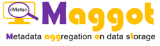
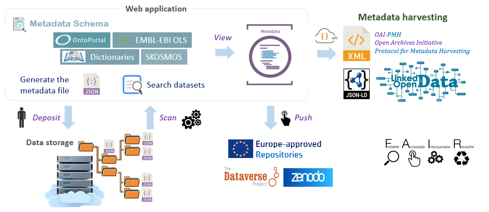

# Home

<h2 style="color: darkviolet;">An ecosystem for producing and sharing metadata</h2>

 

### Foster good data management, with data sharing in mind

Sharing descriptive [Metadata][3]{:target="_blank"} is the first essential step towards [Open Scientific Data][2]{:target="_blank"}. With this in mind, Maggot was specifically designed to annotate datasets by creating a metadata file to attach to the storage space. Indeed, it allows users to easily add descriptive metadata to datasets produced within a collective of people (research unit, platform, multi-partner project, etc.). This approach fits perfectly into a data management plan as it addresses the issues of data organization and documentation, data storage and frictionless metadata sharing within this same collective and beyond.

----

### Main features of Maggot

The main functionalities of Maggot were established according to a well-defined need (See [Background](./about/#background)).

1. Documente with [Metadata][3]{:target="_blank"} your datasets produced within a collective of people, thus making it possible :
	* to answer <a href="./images/DMP_fig.png" data-lightbox="fig8">certain questions</a> of the [Data Management Plan (DMP)][4]{:target="_blank"} concerning the organization, documentation, storage and sharing of data in the data storage space, 
	* to meet certain data and metadata requirements, listed for example by the [Open Research Europe][5]{:target="_blank"} in accordance with the [FAIR principles][7]{:target="_blank"}.
2. Search datasets by their metadata
    * Indeed, the descriptive metadata thus produced can be associated with the corresponding data directly in the storage space then it is possible to perform a search on the metadata in order to find one or more sets of data. Only descriptive metadata is accessible by default.
3. Publish the metadata of datasets along with their data files into an [Europe-approved repository][8]{:target="_blank"}

_See a short [Presentation][11]{:target="_blank"} and [Poster][12]{:target="_blank"} for a quick overview_.

 

### Overview of the different stages of metadata management

 
**_Note:_**  _The step numbers indicated in the figure correspond to the different points developed below_

**1** - First you must define all the [metadata][3]{:target="_blank"} that will be used to describe your datasets.
<a href="javaScript:;" class="extra-js extra-show-js">&nbsp;&nbsp; :octicons-chevron-down-16:</a>
All metadata can be defined using a single file (in TSV format, therefore using a spreadsheet). This is a unavoidable step because both input and search interfaces are completely generated from these definition files, defining in this way each of the fields along with their <a href="./images/terminology_types.png" data-lightbox="fig0">input type</a> and also the associated Controlled Vocabulary ([ontology][18]{:target="_blank"}, [thesaurus][19]{:target="_blank"}, dictionary, list of fixed terms). The metadata proposed by default was mainly established according to the [DDI][9]{:target="_blank"} (Data Documentation Initiative) [metadata schema][10]{:target="_blank"}. This schema also largely corresponds to that adopted by the [Dataverse][16]{:target="_blank"} software. See the [Terminology Definition](./definitions/terminology.md) section.
<a href="javaScript:;" class="extra-js-2 extra-hide-js">&nbsp; :octicons-chevron-up-16: </a>

**2** - Entering metadata will be greatly facilitated by the use of [dictionaries](./dictionaries.md).
<a href="javaScript:;" class="extra-js extra-show-js">&nbsp;&nbsp; :octicons-chevron-down-16:</a>
The dictionaries offered by default are: <i><a href="./images/dico1.png" data-lightbox="fig7">people</a></i>, <i><a href="./images/dico9.png" data-lightbox="fig9">funders</a></i>, <i><a href="./images/dico8.png" data-lightbox="fig8">data producers</a></i>, as well as a <i><a href="./images/dico7.png" data-lightbox="fig3">vocabulary</a></i> dictionary allowing you to mix ontologies and thesauri from several sources. Each of these dictionaries allows users, by entering a name by autocompletion, to associate information which will then be added when exporting the metadata either to a remote repository, or for harvesting the metadata. Thus this information, once entered into a dictionary, will not need to be re-entered again.
<a href="javaScript:;" class="extra-js-2 extra-hide-js">&nbsp; :octicons-chevron-up-16: </a>

**3** - The web interface for entering metadata is entirely built on the basis of [definition files](./definitions/index.md). 
<a href="javaScript:;" class="extra-js extra-show-js">&nbsp;&nbsp; :octicons-chevron-down-16:</a>
The metadata are distributed according to the different sections chosen, each constituting a tab (see <a href="./images/entry_fig2.png" data-lightbox="fig5">screenshot</a>). Mandatory fields are marked with a red star and must be documented in order to be able to generate the metadata file. The entry of metadata governed by a controlled vocabulary is done by autocompletion from term lists (<i>dictionary, thesaurus or ontology</i>). We can also define external resources (URL links) relating to documents, publications or other related data. Maggot thus becomes a hub for your datasets connecting different resources, local and external. Once the mandatory fields (at least) and other recommended fields (at best) have been entered, the metadata file can be generated in JSON format.
<a href="javaScript:;" class="extra-js-2 extra-hide-js">&nbsp; :octicons-chevron-up-16: </a>

**4** - The file generated in JSON format must be placed in the [storage space](./infrastructure.md) reserved for this purpose. 
<a href="javaScript:;" class="extra-js extra-show-js">&nbsp;&nbsp; :octicons-chevron-down-16:</a>
The role played by this metadata file can be seen as a README file adapted for machines, but also readable by humans. With an internal structure, it offers coherence and consistency of information that a simple README file with a completely free and therefore unstructured text format does not allow. Furthermore, the central idea is to use the storage space as a local data repository, so that the metadata should go to the data and not the other way around.
<a href="javaScript:;" class="extra-js-2 extra-hide-js">&nbsp; :octicons-chevron-up-16: </a>

**5** - A search of the datasets can thus be carried out on the basis of the metadata. 
<a href="javaScript:;" class="extra-js extra-show-js">&nbsp;&nbsp; :octicons-chevron-down-16:</a>
Indeed, all the JSON metadata files are scanned and parsed according to a fixed time interval (30 min) then loaded into a database. This allows you to perform searches based on predefined metadata. The search form, in a compact shape, is almost the same as the entry form (see a <a href="./images/search_fig.png" data-lightbox="fig6">screenshot</a>). Depending on the search criteria, a list of data sets is provided, with for each of them a link pointing to the detailed sheet.
<a href="javaScript:;" class="extra-js-2 extra-hide-js">&nbsp; :octicons-chevron-up-16: </a>

**6** - The detailed metadata sheet provides all the metadata divided by section. 
<a href="javaScript:;" class="extra-js extra-show-js">&nbsp;&nbsp; :octicons-chevron-down-16:</a>Unfilled metadata does not appear by default. When a URL can be associated with information (ORCID, Ontology, web site, etc.), you can click on it to go to the corresponding link. Likewise, it is possible to follow the associated link on each of the resources. From this sheet, you can also export the metadata according to different schemata (Dataverse, Zenodo, JSON-LD). See <a href="./images/metadata_fig0.png" data-lightbox="fig7">screenshot 1</a> & <a href="./images/metadata_fig1.png" data-lightbox="fig4">screenshot 2</a>.
<a href="javaScript:;" class="extra-js-2 extra-hide-js">&nbsp; :octicons-chevron-up-16: </a>

**7** - Finally, once you have decided to [publish your metadata](publish/index.md) with your data, you can choose the repository 
<a href="javaScript:;" class="extra-js extra-show-js">&nbsp;&nbsp; :octicons-chevron-down-16:</a>that suits you (currently repositories based on [Dataverse][16]{:target="_blank"} and [Zenodo][17]{:target="_blank"} are supported).
<a href="javaScript:;" class="extra-js-2 extra-hide-js">&nbsp; :octicons-chevron-up-16: </a>

 

### Additional key points

   * 
Being able to generate descriptive metadata from the start of a project or study without waiting for all the data to be acquired or processed, nor for the moment when one wish to publish data, thus respecting the [research data lifecycle][20]{:target="_blank"} as best as possible. [Read more](chats/chat2){:target="_blank"}.

   * 
The implementation of the tool requires involving all data stakeholders upstream (definition of the metadata schema, vocabularies, targeted data repositories, etc.); everyone has their role: [data manager/data steward][22]{:target="_blank"} on one side but also [scientists and data producers][21]{:target="_blank"} on the other. [Read more](chats/chat1){:target="_blank"}.

   * 
A progressive rise towards an increasingly [controlled and standardized vocabulary][23]{:target="_blank"} is not only possible but even encouraged. First we can start with a simple vocabulary dictionary used locally and grouping together domain vocabularies. Then we can consider the creation of a thesaurus with or without mapping to ontologies. The promotion of ontologies must also be done gradually by selecting those which are truly relevant for the collective. A tool like Maggot makes it easy to implement them (See [Vocabulary](./definitions/vocabulary.md)). [Read more](chats/chat3){:target="_blank"}.

  

---

[][1]{:target="_blank"}

*[TSV]: Open text format representing tabular data as "Tab-Separated Values". Each row corresponds to a table row and the cells in a row are separated by a tab
*[JSON]: JavaScript Object Notation : format used to represent structured information
*[autocompletion]: feature in which an application predicts the rest of a word a user is typing

[1]: https://www.inrae.fr/en
[2]: https://en.wikipedia.org/wiki/Open_scientific_data
[3]: https://www.opendatasoft.com/en/glossary/metadata/
[4]: https://en.wikipedia.org/wiki/Data_management_plan
[5]: https://open-research-europe.ec.europa.eu/for-authors/data-guidelines
[6]: https://www.ouvrirlascience.fr/second-national-plan-for-open-science/
[7]: https://open-research-europe.ec.europa.eu/for-authors/data-guidelines#fairdata
[8]: https://open-research-europe.ec.europa.eu/for-authors/data-guidelines#approvedrepositories
[9]: https://ddialliance.org/
[10]: https://en.wikipedia.org/wiki/Metadata_standard
[11]: https://inrae.github.io/pgd-mmdt/pdf/MAGGOT_Presentation_Jan2024.pdf?download=false
[12]: https://inrae.github.io/pgd-mmdt/pdf/MAGGOT_Poster_May2024.pdf?download=false
[13]: https://pmb-bordeaux.fr/maggot/entry
[14]: https://pmb-bordeaux.fr/maggot/search
[15]: https://github.com/djacob65/maggot-fb
[16]: https://dataverse.org/
[17]: https://www.openaire.eu/zenodo-guide
[18]: https://en.wikipedia.org/wiki/Ontology_(information_science)
[19]: https://en.wikipedia.org/wiki/Thesaurus_(information_retrieval)

[20]: https://www.reading.ac.uk/research-services/research-data-management/about-research-data-management/the-research-data-lifecycle
[21]: https://www.opendatasoft.com/en/glossary/data-producer/
[22]: https://www.opendatasoft.com/en/glossary/data-steward/
[23]: https://pitt.libguides.com/metadatadiscovery/controlledvocabularies
[24]: https://chatgpt.com/share/289ce83e-2db4-4f8f-a924-b0a37745b0d2
[25]: https://chatgpt.com/share/34dd9b51-2371-494e-967d-83ba6e13c031
[26]: https://chatgpt.com/share/d6588b81-2b25-4a78-8cf2-34b5e7cd96c4

