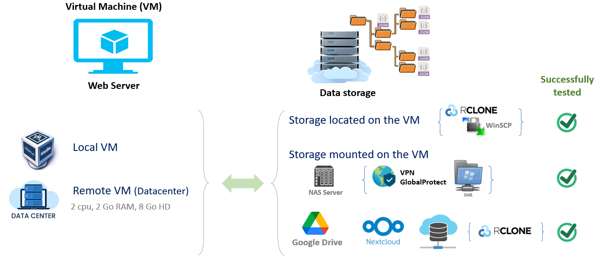

# Infrastructure

### Infrastructure : Local, Remote or Mixed

The necessary Infrastructure involves **1**) a machine running a Linux OS and **2**) a dedicated storage space.

**1** - The machine will most often be of "[virtual][1]{:target="_blank"}" type because more simpler to deploy, either locally (with VM providers such as [VirtualBox][2]{:target="_blank"}, [VMware Workstation][3]{:target="_blank"} or [MS Hyper-V][16]{:target="_blank"}) or remotely (e.g [VMware ESXi][12]{:target="_blank"}, [Openstack][13]{:target="_blank"}: [example of deployment][14]{:target="_blank"}). Moreover, the OS of your machine must allow you the deployment of [docker][4]{:target="_blank"} containers. See for more details on “[What is Docker][5]{:target="_blank"}”. The minimum characteristics of the VM are:  *2 cpu*, *2 Go RAM*, *8 Go HD*.

**2** - The dedicated storage space could be either in the local space of the VM, or in a remote place on the network.

* If the storage space is directly included in the VM, then tools like [WinSCP][6]{:target="_blank"} or [RcloneBrowser][7]{:target="_blank"} will allow you to easily transfer your files to the data space.
* If the storage space is your collective's NAS, you will need to make sure to open the port corresponding to the remote disk mount protocol (e.g [SMB][17]{:target="_blank"}, [NFS][18]{:target="_blank"}, [iSCSI][19]{:target="_blank"}, ...). on your network's firewall. If both VM and data storage are not in the same private network, it will probably also require installing the sofware layer corresponding to your corporate VPN on the VM so that it can access your NAS. See <a href="../images/infra_ex1.png" data-lightbox="fig1">example successfully tested</a>.
* If the storage space is in a [data center][9]{:target="_blank"} (e.g. [NextCloud][10]{:target="_blank"}, [Google Drive][15]{:target="_blank"}), then you will need to install a tool such as [rclone][11]{:target="_blank"} on your VM in order to be able to mount the storage space on the VM's disk space. See <a href="../images/infra_ex2.png" data-lightbox="fig2">example successfully tested</a>.

 

[1]: https://en.wikipedia.org/wiki/Virtual_machine
[2]: https://www.virtualbox.org/
[3]: https://www.vmware.com/products/workstation-player.html
[4]: https://www.docker.com/get-started/
[5]: https://opensource.com/resources/what-docker
[6]: https://winscp.net/eng/download.php
[7]: https://kapitainsky.github.io/RcloneBrowser/

[9]: https://en.wikipedia.org/wiki/Data_center
[10]: https://nextcloud.com/files/
[11]: https://rclone.org/
[12]: https://www.vmware.com/products/esxi-and-esx.html
[13]: https://www.openstack.org/
[14]: https://inrae.github.io/jupyterhub-vm/
[15]: https://ucr-research-computing.github.io/Knowledge_Base/how_to_mount_google_drive.html
[16]: https://www.youtube.com/watch?v=CaDzYUSdVn8&ab_channel=URTechDotCa

[17]: https://en.wikipedia.org/wiki/Server_Message_Block
[18]: https://en.wikipedia.org/wiki/Network_File_System
[19]: https://en.wikipedia.org/wiki/ISCSI

[20]: https://github.com/inrae/pgd-mmdt/blob/main/dockerdbpart/initialisation/setupdb-js.template
[21]: https://github.com/inrae/pgd-mmdt/blob/main/dockerscanpart/scripts/config.py
[22]: https://github.com/inrae/pgd-mmdt/blob/main/web/inc/config/config.inc
[23]: https://github.com/inrae/pgd-mmdt/blob/main/run
[24]: https://github.com/inrae/pgd-mmdt/blob/main/web/inc/config/mongodb.inc
