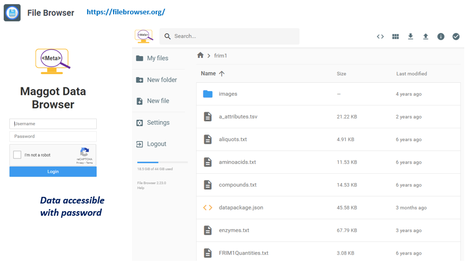

# Installation

<style>.md-typeset h1 {display: none;} .md-nav__item {font-size: medium}</style>

### Install on your linux computer or linux / unix server

Requirements: The installation must be carried out on a (virtual) machine with  a recent Linux OS that support [Docker][4]{:target="_blank"} (see [Infrastructure](../infrastructure))

<br>

#### Retrieving the code
Go to the destination directory of your choice then clone the repository and `cd` to your clone path:

```sh
git clone https://github.com/inrae/pgd-mmdt.git pgd-mmdt
cd pgd-mmdt
```

<br>

#### Installation of Docker containers

MAGGOT uses 3 Docker images for 3 distinct services:

* **pgd-mmdt-db** which hosts the [MongoDB][17]{:target="_blank"} database
* **pgd-mmdt-scan** which scans the data and updates the contents of the database and the web interface
* **pgd-mmdt-web** which hosts the web server and the web interface pages

<br>

#### Configuration

*  *[run][23]{:target="_blank"}* : defines root of the data directory (including for development)
*  *[dockerdbpart/initialisation/setupdb-js.template][20]{:target="_blank"}* : defines MongoDB settings
*  *[dockerscanpart/scripts/config.py][21]{:target="_blank"}* : defines MongoDB settings (dbserver, dbport, username, password)
*  *[web/inc/config/mongodb.inc][24]{:target="_blank"}* : defines MongoDB settings (dbserver, dbport, username, password)
*  *[web/inc/config/config.inc][22]{:target="_blank"}* : defines many of web parameters (modify only if necessary)
*  ***web/inc/config/local.inc*** : defines the application parameters specific to the local installation (not erase when updating).

See [Configuration settings](../settings)

***Warning*** : You have to pay attention to put the same MongoDB settings in all the above configuration files. It is best not to change anything. It would have been preferable to put a single configuration file but this was not yet done given the different languages involved (bash, javascript, python, PHP). To be done!

***Warning*** : If you are using VirtualBox with Windows then you must make sure to [Enable AVX](../avx_win11_vbox)

***Note*** : If you want to run multiple instances, you will need to change in the *[run](../settings/#run)* file, *i)* the container names, *ii)* the data path, *iii)* the MongoDB volume name and *iv)* the MongoDB port

The following two JSON files are defined by default but can be easily configured from the web interface. See the [Terminology Configuration](../configuration) section.

*  ***web/conf/config_terms.json*** : define the [terminology](../definitions/terminology)
*  ***web/conf/maggot-schema.json*** : define the JSON schema used to validate metadata files.

<br>

#### Commands 

The ***run*** shell script allows you to perform multiple actions by specifying an option :

```sh
cd pgd-mmdt
sh ./run <option>
```

**Options**:

* ***build*** : Create the 3 Docker images namely ***pgd-mmdt-db***, ***pgd-mmdt-scan*** and ***pgd-mmdt-web***
* ***pull*** : Get (pull) from DockerHub the 3 Docker images namely ***pgd-mmdt-db***, ***pgd-mmdt-scan*** and ***pgd-mmdt-web***
* ***start*** : _1_) Launch the 3 services by creating the Docker containers corresponding to the Docker images; _2_) Create also the MongoDB volume.
* ***stop*** :  _1_) Remove all the 3 Docker containers; _2_) Remove the MongoDB volume.
* ***initdb*** : Create and initialize the Mongo collection
* ***scan*** : Scan the data  according to a fixed period ([30 min][18]{:target="_blank"}) and update the contents of the database and the web interface
* ***fullstart*** : Perform the 3 actions ***start***, ***initdb*** and ***scan***
* ***restart*** : Perform the 2 actions ***stop*** then ***fullstart***
* ***ps*** : Check that all containers are running correctly
* ***passwd*** <_user_>: Define the admin password if no _user_ is specified, allowing you to copy the new configuration file on the server via the web interface (see [configuration](../configuration) and to add entries in dictionaries. If a _user_ is specified, the dictionary consultation will be authorized for this user.

<br>

#### Starting the application

* You must first either build the 3 docker container images ... (using MongoDB 6.0+ with [AVX enabled](../avx_win11_vbox))
   ```sh
   sh ./run build
   ```

* ... or pull the 3 images from DockerHub (using MongoDB 4.4)
   ```sh
   sh ./run pull
   ```

* The application can be sequentially started :

    * Starting the web interface
     ```sh
     sh ./run start
     ```
    * Initialization of the MongoDB database
     ```sh
     sh ./run initdb
     ```
    * Scanning the data directory for metadata files (META_XXXX.json)
     ```sh
     sh ./run scan
     ```

* You can also launch these 3 steps with a single command:
   ```sh
   sh ./run fullstart
   ```

<br>

#### Launching the web application in the web browser

* Once the application is started, we can see if the containers are started using the following command:
   ```sh
   docker ps -a
   ```

* which should produce a result similar to the following:

<pre style="color:#060606; font-size: 12px;">
   CONTAINER ID  IMAGE          COMMAND                 CREATED          STATUS         PORTS                                  NAMES
   5914504f456d  pgd-mmdt-web   "docker-php-entrypoi."  12 seconds ago   Up 10 seconds  0.0.0.0:8087->80/tcp, :::8087->80/tcp  mmdt-web
   226b13ed9467  pgd-mmdt-scan  "cron -f"               12 seconds ago   Up 11 seconds                                         mmdt-scan
   81fecbb56d23  pgd-mmdt-db    "docker-entrypoint.s."  13 seconds ago   Up 12 seconds  27017/tcp                              mmdt-db
</pre>

* On the first line, the one which corresponds to the web interface, we see that port 80 of the docker is exported to port 8087 of the VM.
Let's say that the IP address of your VM is 192.168.56.2, then in your browser you will need to put the URL http://192.168.56.2:8087/. You can of course change the port number in the '*[run](../settings/#run)*' file.

* It may be preferable to use a lightweight http server like [nginx][27]{:target="_blank"} so that the Maggot URL will be http://192.168.56.2/maggot/. Below an example of config:
   ```sh
   ## /etc/nginx/nginx.conf
   http {
   
   ...
       upstream maggot  { server 127.0.0.1:8087; }
   ...
   
   }
   
   ## /etc/nginx/conf.d/my-site.conf
   
   server {
       listen 80 default;
       server_name $host;
   
   ...
   
       location /maggot/ {
           proxy_set_header Host $host;
           proxy_set_header X-App-Name 'maggot';
           proxy_set_header X-Real-Ip $remote_addr;
           proxy_set_header X-Forwarded-Host $host;
           proxy_set_header X-Forwarded-For $proxy_add_x_forwarded_for;
           proxy_pass http://maggot/;
       }
   
   ...
   
   }
   ```

<br>

#### Stoping the application

* To stop the application :
   ```sh
   sh ./run stop
   ```

<br>

#### Updating the application

When updating the application, it is imperative to preserve a whole set of configuration files as well as the content of certain directories (dictionaries, javascripts dedicated to vocabularies, etc.). An update script is available ([./etc/update-maggot.sh][19]{:target="_blank"}) preferably placed under '**/usr/local/bin**'. To preserve your configuration, it is recommended to create local configuration files.

* A first file '**local.conf**' will contain all the parameters to be preserved, initially contained in the '*[run](../settings/#run)*' file. A small example could be as follow :
   ```sh
   #!/bin/bash

   # Local HTTP Port for web application
   WEB_PORT=8088

   # Path to the data
   DATADIR=/media/Workdir/Share/DATA/
   ```

* A second file '**./web/inc/config/local.inc**' will contain all the parameters to be preserved, initially contained in the '*[./web/inc/config/config.inc](../settings/#incconfigconfiginc)*' file. A small example could be as follow :
   ```php
   <?php

   # Main title
   $TITLE ='Metadata management - My Labs';
   $MAINTITLE =$TITLE;

   # File Browser
   $FILEBROWSER=1;
   $URL_FILEBROWSER='/fb/';

   # Enable some functionalities
   $export_oai = 1;

   ?>
   ```


------

### Architecture diagram

<center>
<a href="../images/schema.png" data-lightbox="fig0"></a><br>
**_Note:_**  _See how to do proceed for [configuration steps](../configuration)._
</center>

-----

### File Browser

You can provide access to your data via a [file browser][25]{:target="_blank"}. This application must be [installed separately][26]{:target="_blank"} but can be connected to Maggot by specifying the corresponding URL in the [configuration file](../settings/#incconfigconfiginc). Users and their rights are managed in the filebrowser application. Likewise, we can also <a href="../images/filebrowser_fig2.png" data-lightbox="fig2">create links to the data without a password</a>. These links can be usefully specified as external resources in the metadata managed by Maggot.

<center>
<a href="../images/filebrowser_fig1.png" data-lightbox="fig10"></a><br>
 _See how to do install in [github][26]{:target="_blank"}._
</center>


<br>

-----

### Authentication

**Purpose**: Implement an authentication layer based on [OAUTH 2.0][30]{:target="_blank"}

The initial choice was not to manage users in the Maggot tool. This choice was made to promote the complete opening by default of metadata within a collective. However, for management within a collective that goes beyond a simple intranet, it is necessary to set up an authentication layer. Setting up such a layer can be done independently of the Maggot tool, i.e. without modifying its code or configuration. An [SSO][31]{:target="_blank"} implementation is proposed online, which can serve as a basis for a larger configuration. A [Wiki page][33]{:target="_blank"} provides a detailed description. 

* Source code on github : [https://github.com/djacob65/maggot-sso/][32]{:target="_blank"}

<br>
<br>

[1]: https://en.wikipedia.org/wiki/Virtual_machine
[2]: https://www.virtualbox.org/
[3]: https://www.vmware.com/products/workstation-player.html
[4]: https://www.docker.com/get-started/
[5]: https://opensource.com/resources/what-docker
[6]: https://winscp.net/eng/download.php
[7]: https://kapitainsky.github.io/RcloneBrowser/
[8]: https://www.upguard.com/blog/smb-port#:~:text=SMB%20ports%20are%20generally%20port,ports%20communicate%20via%20Port%20139.
[9]: https://en.wikipedia.org/wiki/Data_center#:~:text=A%20data%20center%20(American%20English,as%20telecommunications%20and%20storage%20systems.
[10]: https://nextcloud.com/
[11]: https://rclone.org/
[12]: https://www.vmware.com/products/esxi-and-esx.html
[13]: https://www.openstack.org/
[14]: https://inrae.github.io/jupyterhub-vm/
[15]: https://ucr-research-computing.github.io/Knowledge_Base/how_to_mount_google_drive.html
[16]: https://www.youtube.com/watch?v=CaDzYUSdVn8&ab_channel=URTechDotCa
[17]: https://www.mongodb.com/basics
[18]: https://github.com/inrae/pgd-mmdt/blob/main/dockerscanpart/scripts/pgd-cron
[19]: https://github.com/inrae/pgd-mmdt/blob/main/etc/update-maggot.sh
[20]: https://github.com/inrae/pgd-mmdt/blob/main/dockerdbpart/initialisation/setupdb-js.template
[21]: https://github.com/inrae/pgd-mmdt/blob/main/dockerscanpart/scripts/config.py
[22]: https://github.com/inrae/pgd-mmdt/blob/main/web/inc/config/config.inc
[23]: https://github.com/inrae/pgd-mmdt/blob/main/run
[24]: https://github.com/inrae/pgd-mmdt/blob/main/web/inc/config/mongodb.inc

[25]: https://filebrowser.org/
[26]: https://github.com/djacob65/maggot-fb
[27]: https://docs.nginx.com/nginx/admin-guide/web-server/web-server/


[30]: https://en.wikipedia.org/wiki/OAuth
[31]: https://en.wikipedia.org/wiki/Single_sign-on
[32]: https://github.com/djacob65/maggot-sso/
[33]: https://github.com/djacob65/maggot-sso/wiki/Single-Sign-On

