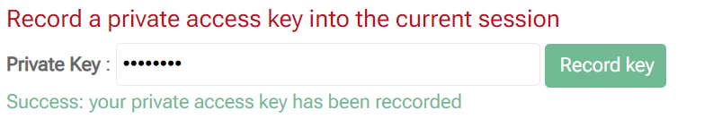

# Private access

###  Private access key management

#### Motivation

Although the Maggot tool is designed to foster the sharing of metadata within a collective, it may be necessary to temporarily privatize access to the metadata of an ongoing project with confidentiality constraints. So even within our own collective, access to metadata must be restricted to authorized users only.

#### Implementation

The choice of not wanting to manage users in the Maggot tool was made in order to make the metadata completely open by default within a collective. Furthermore, access rights to the storage space are managed independently of the Maggot tool by the administrator of this space. It is therefore through the storage space that we must give or not access to the metadata via the web interface.

The chosen mechanism for privatizing access is described below. It has the dual advantage of being simple to implement and simple to use.

1. First we have to generate a file containing the encrypted key for a private access. This file must be generated from the web interface then downloaded as shown in the figure below. Then this file must be manually deposited in the data directory corresponding to the dataset whose access we wish to privatize. The presence of this file within a directory is enough to block access to metadata and data by default. It should be noted that we can put this same file containing the encrypted private key in several data directories (included within the same project for example). The deposit must be done by hand because the Maggot tool must only have access to the storage space in read mode. This also guarantees that the user has writing rights to this space without having to manage user accounts on the Maggot side.

    

    
    

    

    _By default, ‘untwist1’ metadata are not accessible to anyone_ 
    
    

2. When we want to have access to the metadata of this dataset, we have to simply enter the private key in the current session.
This will have the effect of unlocking access to the metadata via the web interface only in the current session of our web browser. This means that we will have to enter the private key for each session (by default, a session lasts a maximum of 1 hour).

    

    
    

    

    _Now the ‘untwist1’ metadata are accessible only to us_ 
    
    

3. When we want to give access to the metadata to the entire collective, we simply need to delete the private access file (named by default '*META_auth.txt*') from the concerned data directory.

  

