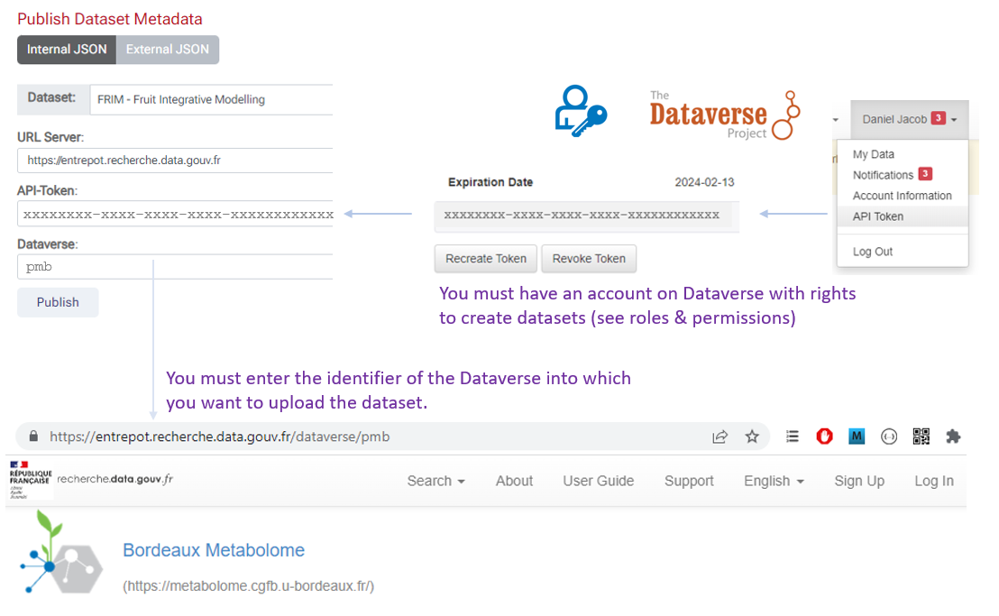
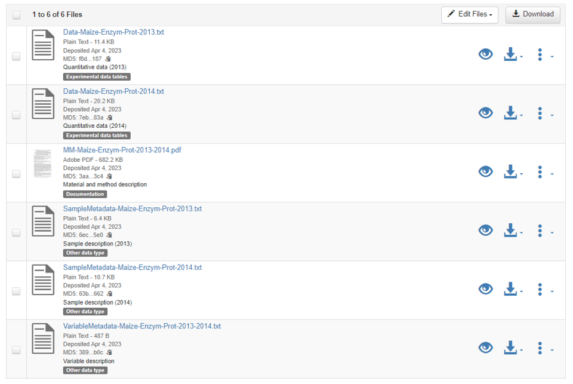

# Publish into Dataverse

###  Publish into Dataverse

* Based on the [Dataverse Native API][2]{:target="_blank"}

**1** - To submit metadata to a Dataverse repository, you must first select a dataset either from the drop-down list corresponding to the datasets listed on the data storage space or a metadata file from your local disk.

**2** - You then need to connect to the repository in order to retrieve the key (the  [API token][1]{:target="_blank"}) authorizing you to submit the dataset. This obviously assumes that you have the privileges (creation/modification rights) to do so.

**3** - After choosing the repository URL, you must also specify on which dataverse collection you want to deposit the datasets. As previously, you must have write rights to this dataverse collection.

 

* Then, all you have to do is click on '**Publish**' to "_push_" the metadata to the repository. The figure below illustrates based on an example how the metadata is recorded in the repository as well as the _Mapping_ corresponding to the fields linked to *Controlled Vocabularies*.

 

#### Deposit data files

* If you also want to deposit data files at the same time as the metadata, you will need:
     
	 * **1** - declare the files to be deposited in the resources; these same files must also be present in the storage space.
     
	 * **2** - create a semaphore file (_META_datafile_ok.txt_); its sole presence, independently of its content (which may be empty) will authorize the transfer. Indeed, the creation of such a file guarantees that the user has actually write rights to the storage space corresponding to his dataset. This prevents someone else from publishing the data without having the right to do so. This mechanism also avoids having to manage user accounts on Maggot.

 

* The figure below illustrates based on an example how data files appear on the repository with annotations corresponding to those created in Maggot.

 

[1]: https://www.wallarm.com/what/what-is-an-api-token-quick-guide
[2]: https://guides.dataverse.org/en/latest/api/native-api.html