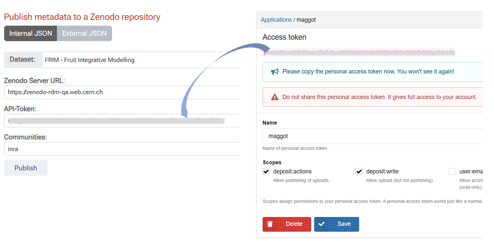
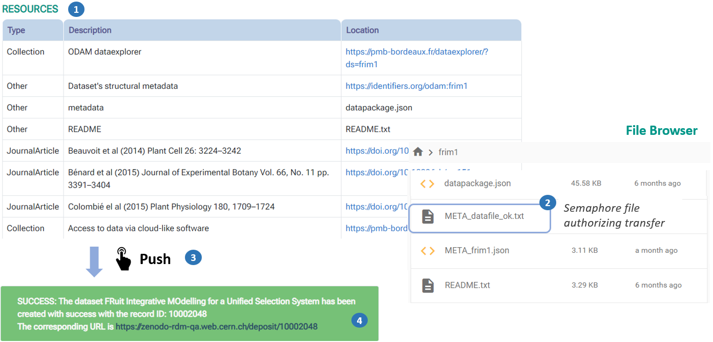
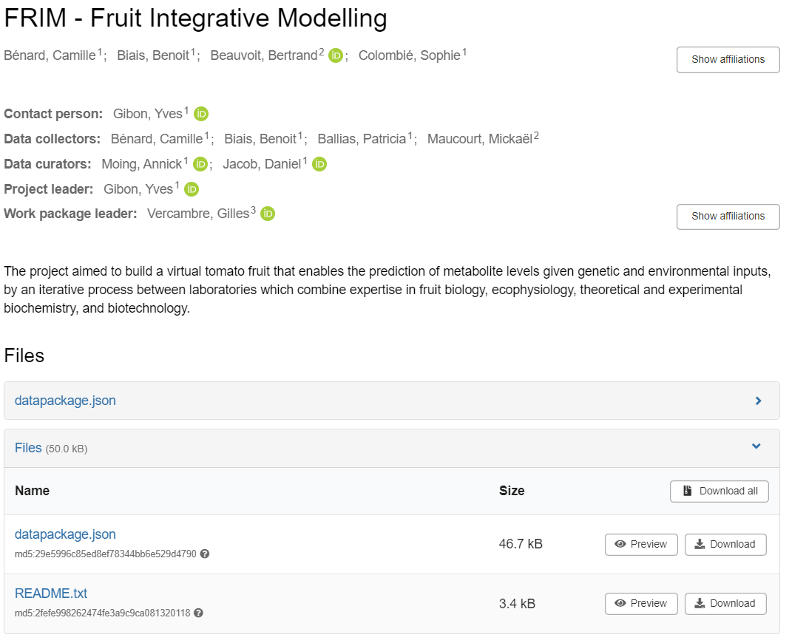
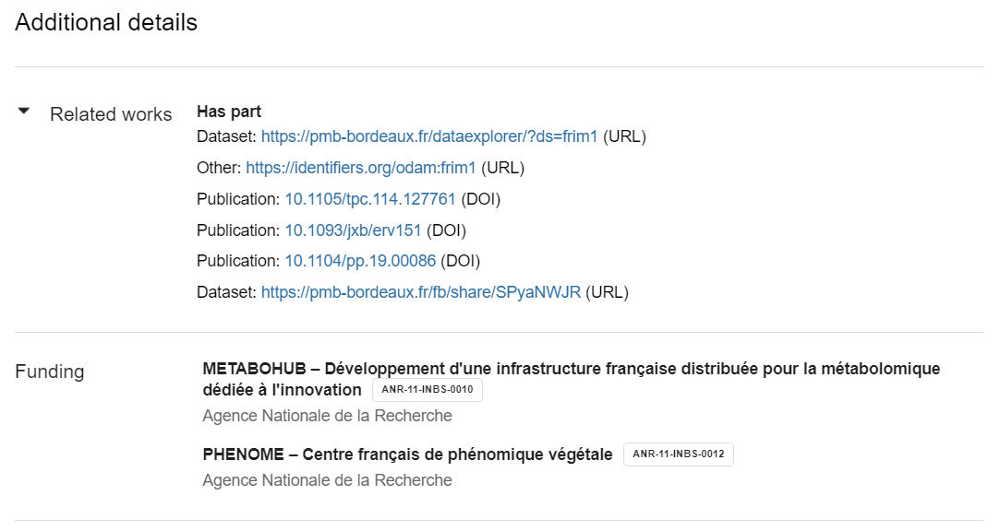
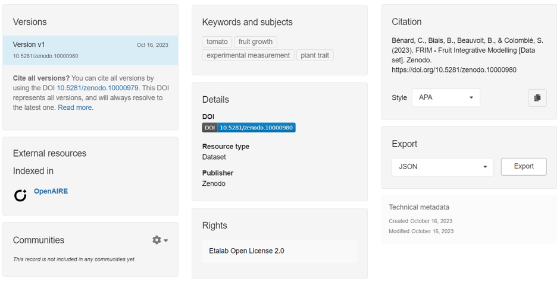

# Publish into Zenodo

###  Publish into Zenodo

* Based on the [Zenodo REST-API][3]{:target="_blank"}

**1** - To submit metadata to a Zenodo repository, you must first select a dataset either from the drop-down list corresponding to the datasets listed on the data storage space or a metadata file from your local disk.

**2** - Unless you have previously saved your [API token][1]{:target="_blank"}, you must create a new one and copy and paste it before validating it. Before validating, you must check the deposit:access and deposit:write boxes in order to obtain creation and modification rights with this token.

**3** - After choosing the repository URL, you can optionally choose a community to which the dataset will be linked. By default, you can leave empty this field.

* ***Warning*** : given the [new changes][2]{:target="_blank"} introduced to the Zenodo validation process (*October 2023*), it seems that it is no longer possible to validate a community via API. Only a choice via the Zenodo web interface will allow you to do so in order to be validated later by the manager of this community.

 

#### Deposit data files

* If you also want to deposit data files at the same time as the metadata, you will need (see figure below)
     
	 * **1** - declare the files to be deposited in the resources (_**1**_) ; these same files must also be present in the storage space.
     
	 * **2** - create a semaphore file (_META_datafile_ok.txt_) (_**2**_); its sole presence, independently of its content will authorize the transfer. Indeed, the creation of such a file guarantees that the user has actually write rights to the storage space corresponding to his dataset. This prevents someone else from publishing the data without having the right to do so. This mechanism also avoids having to manage user accounts on Maggot.

* Then, all you have to do is click on '**Publish**' to "_push_" the metadata and data to the repository (_**3**_).

* After submission and if everything went well, a link to the deposit will be given to you (_**4**_).

 

* The figure below illustrates based on an example how the metadata and data is recorded in the repository.

 

[1]: https://www.wallarm.com/what/what-is-an-api-token-quick-guide
[2]: https://help.zenodo.org/docs/about/whats-changed/#deposit-communities
[3]: https://developers.zenodo.org/#rest-api
