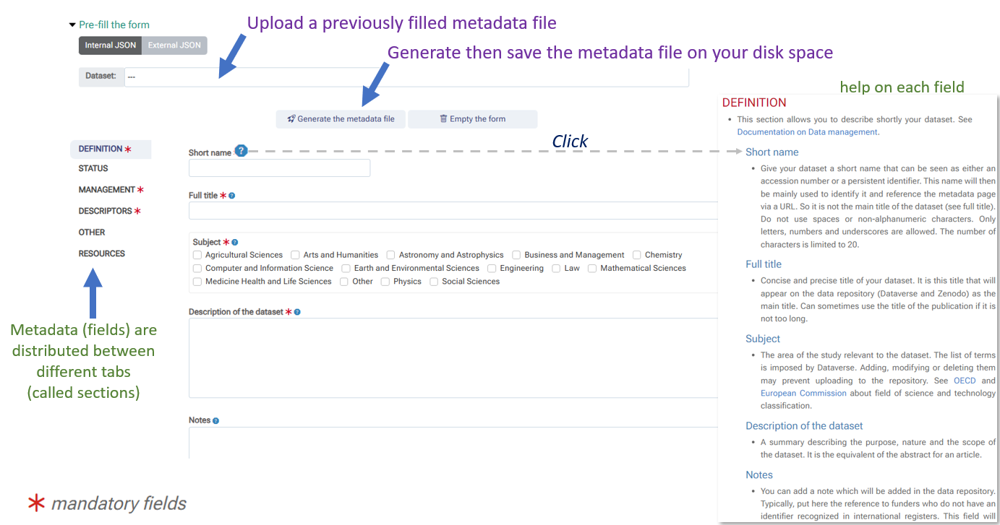
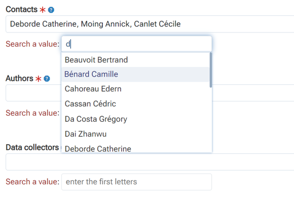
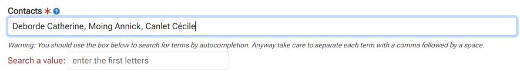
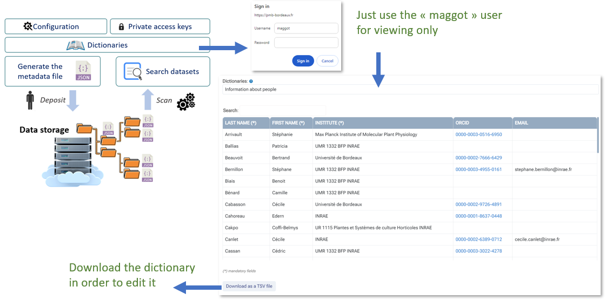
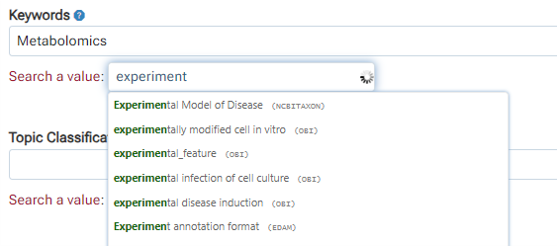
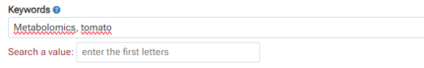
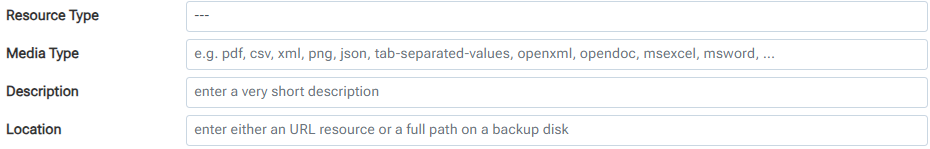

# Quick tutorial

### Metadata Entry

The figures are given here for illustration purposes but certain elements may be different for you given that this will depend on the configuration on your instance, in particular the choice of metadata, and the associated vocabulary sources.

Indeed, the choice of vocabulary sources (ontologies, thesauri, dictionaries) as well as the choice of metadata fields to enter must in principle have been the subject of discussion between data producers and data manager during the implementation of the Maggot tool in order to find the best compromise between the choice of sources and all the scientific fields targeted (see [Definition files](../../definitions)). However a later addition is always possible.

 

#### Overview

When you enter the metadata entry module you should see a page that looks like the figure below:

 

* All the fields (metadata) to be filled in are distributed between several tabs, also called sections. Each section tries to group together a set of fields relating to the same topic.

* You can reload a previously created metadata file. All form fields will then be initialized with the value(s) defined in the metadata file.

* You must at least complete the mandatory fields marked with a red star.

* It is possible to obtain help for each field to be completed. A mini-icon with a question mark is placed after each field label. By clicking on this icon, a web page opens with the focus on the definition of the corresponding field. This help should provide you with at least a definition of a field and, if necessary, instructions on how to fill it in. It should be noted that the quality of the documentation depends on each instance and its configuration.

* Once the form has been completed, even partially (at least those which are mandatory and marked with a red star), you can export your metadata in the form of a file. See [Metadata File](../metadata)

 

#### Dictionaries

[Dictionary-based metadata](../../dictionaries/) (e.g. people's names) can easily be entered by autocomplete in the 'Search value' box provided the name appears in the corresponding dictionary.

 

However, if the name does not yet appear in the dictionary, simply enter the full name (first name & last name) in the main box, making sure to separate each name with a comma and then a space as shown in the figure below.

 

Then you can request to add the additional person name(s) to the dictionary later as described below:

 

* From the home page, select "__Dictionaries__". As username, just put "_maggot_" (this might be different within your instance).

* Then after choosing the "__people__" dictionary, you can download the entire dictionary in a TSV file ([Tab-Separated Values][2]{:target="_blank"}) ready to be edited with your favorite spreadsheet.

* Add all the desired people's names with their institution, and possibly their [ORCID][1]{:target="_blank"} and their email address. Please note that emails are required for authors and contacts

* You will then just have to send it to the data manager so that he can add new people's names to the online dictionary.

Please proceed in the same way for all [dictionaries](../../dictionaries/) (_people_, _funders_, _producer_, _vocabulary_)

 

#### Controlled Vocabulary

Depending on the configuration of your instance, it is very likely that certain fields (eg. keywords) are connected to a controlled vocabulary source (e.g. ontology, thesaurus). [Vocabulary](../../definitions/vocabulary) based on ontologies, thesauri or even dictionaries can easily be entered by autocomplete in the "search for a value" box provided that the term exists in the corresponding vocabulary source. 

 

If a term cannot be found by autocomplete, you can enter the term directly in the main box, making sure to separate each term with a comma and a space as shown in the figure below.

 

The data steward will later try to link it to a vocabulary source that may be suitable for the domain in question. Furthermore, even if the choice of vocabulary sources was made before the tool was put into service, a later addition is always possible. You should make the request to your data manager.

 

#### Resources

Because data is often scattered across various platforms, databases, and file formats, this making it challenging to locate and access. This is called [data fragmentation][5]{:target="_blank"}. So the Maggot tool allows you to specify resources, i.e. data in the broader sense, whether external or internal, allowing to centralize all links towards data.

* External resources will be specified by a URL with preference for a permanent identifier (e.g. [DOI][3]{:target="_blank"}) but also any URL pointing to data whether they comply with the FAIR principle (e.g. [ODAM][4]{:target="_blank"}) or not.
* Internal resources will be the data files to be uploaded to the data repository at push time. In the latter case the exact name of the file on the storage space must appear in the location field.
* Furthermore, in the case of local data management, it would be wise to indicate in which space the data is located if it is not located in the same place as the metadata (e.g. [NextCloud][6]{:target="_blank"}, Unit [NAS][7]{:target="_blank"}, etc.)

Four fields must be filled in :

* __Resource Type__ : Choose the type of the resource in the droplist.

* __Media Type__ : Choose a media type if applicable by autocomplete.

* __Description__ : Provide a concise and accurate description of the resource. Must not exceed 30 characters.

* __Location__ : Preferably indicate an URL to an external resource accessible to all. But it can also be a password-protected resource (e.g. a disk space on the cloud). This can also be text clearly indicating where the resource is located (internal disk space). Finally, this can be the name of a file deposited on the same disk space as the metadata file, in order to be able to push it in the data repository at the same time as the metadata (see [Publication](../../publish)).

   

*[TSV]: Open text format representing tabular data as "Tab-Separated Values". Each row corresponds to a table row and the cells in a row are separated by a tab.
*[JSON]: JavaScript Object Notation : format used to represent structured information.
*[autocomplete]: feature in which an application predicts the rest of a word a user is typing.
*[data manager]: The data manager is the person who sets the data policy, i.e. its implementation and governance.
*[data producers]: The data producers are the people who produced data and by extension have rights over it. They are also those who have the best knowledge of it.
*[data steward]: The data steward is the person who is responsible for data quality, and therefore has a role in data curation.
*[users]: The user are the persons who want to use the data.

[1]: https://info.orcid.org/what-is-orcid/
[2]: https://en.wikipedia.org/wiki/Tab-separated_values
[3]: https://en.wikipedia.org/wiki/Digital_Object_Identifier
[4]: https://inrae.github.io/ODAM/
[5]: https://www.cohesity.com/glossary/data-fragmentation/
[6]: https://nextcloud.com/
[7]: https://en.wikipedia.org/wiki/Network-attached_storage