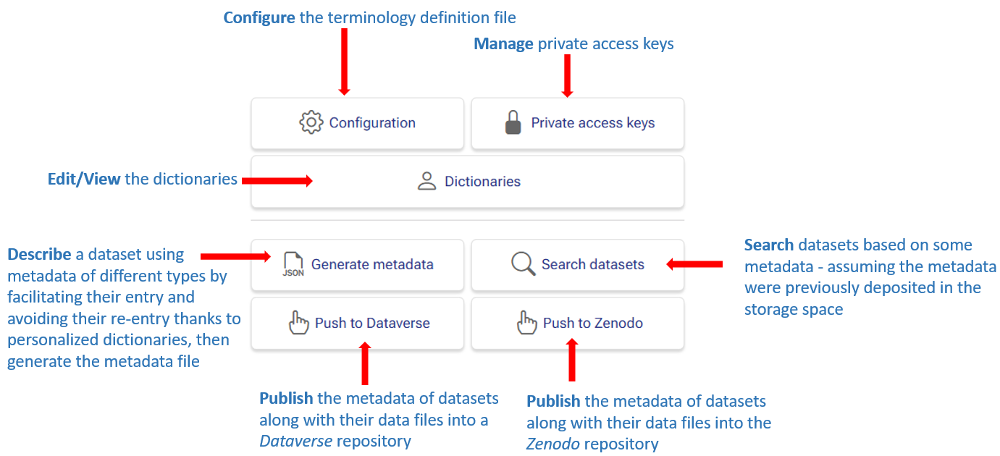

# Quick tutorial

### Quick tutorial

This is a quick tutorial of how to use the Maggot tool in practice and therefore preferably targeting the end user. 

See a short [Presentation][2]{:target="_blank"} and [Poster][3]{:target="_blank"} if you want to have a more general overview of the tool.

 

#### Overview

The Maggot tool is made up of several modules, all accessible from the main page by clicking on the corresponding part of the image as shown in the figure below:

 

__Configuration__
: 
This module mainly concerns the data manager and makes it possible to construct all the terminology definition files, i.e. the metadata and sources of associated vocabularies. See [Definition files](../definitions) then [Configuration](../configuration).

__Private Access__
: 
This module allows data producer to temporarily protect access to metadata for the time necessary before sharing it within his collective. See [Private access key management](../private-access/).

__Dictionaries__
: 
This module allows data producer to view content of all dictionaries. It also allows data steward to edit their content. See [Dictionaries](../dictionaries) for technical details only.

__Metadata Entry__
: 
This is the main module allowing the data producer to enter their metadata relating to a dataset. See the corresponding tutorial for [Metadata Entry](describe).

__Search datasets__
: 
This module allows users to search datasets based on the associated metadata, to see all the metadata and possibly to have access to the data itself. This obviously assumes that the metadata files have been deposited in the correct directory in the storage space dedicated to data management within your collective. See [Infrastructure](../infrastructure).

__File Browser__
: 
This module gives users access to a [file browser][1]{:target="_blank"} provided that the data manager has installed it. See [File Browser](../installation/#file-browser)

__Publication__
: 
This module allows either the data producer or the data steward to publish the metadata with possibly the corresponding data within the suitable data repository. See [Publication](../publish)

   

*[data manager]: The data manager is the person who sets the data policy, i.e. its implementation and governance.
*[data producer]: The data producer is the person who produced data and by extension has rights over it. She is also the one who has the best knowledge of it.
*[data steward]: The data steward is the person who is responsible for data quality, and therefore has a role in data curation.
*[users]: The user are the persons who want to use the data.

[1]: https://filebrowser.org/features
[2]: https://inrae.github.io/pgd-mmdt/pdf/MAGGOT_Presentation_Jan2024.pdf?download=false
[3]: https://inrae.github.io/pgd-mmdt/pdf/MAGGOT_Poster_May2024.pdf?download=false

