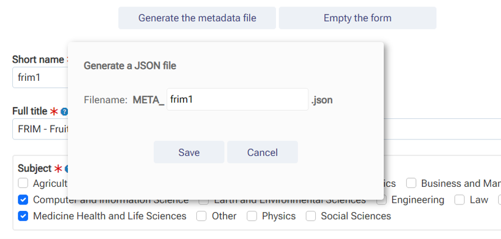
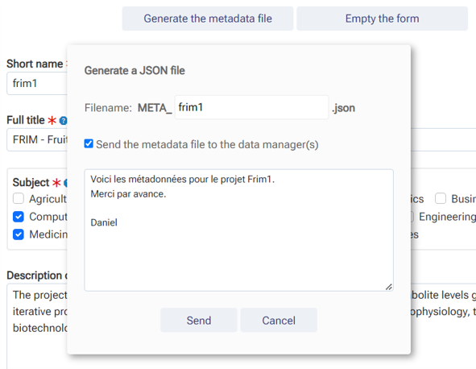
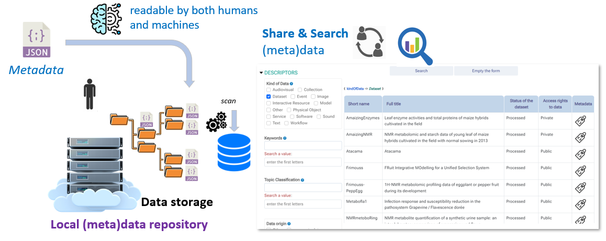
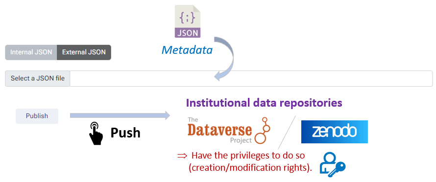

# Quick tutorial

### Metadata File

Once the form has been completed, even partially (at least those which are mandatory and marked with a red star), you can export your metadata in the form of a file. The file is in JSON format and must have the prefix 'META_'.

By clicking on the "Generate the metadata file" button, you can save it on your disk space. 

Furthermore, if email sending has been configured (see [settings](../../settings/#incconfigconfiginc)), then you have the possibility to send the metadata file to the data managers for curation, and possibly also to support its storage on data disk space if specific rights are required.

In case you want to save the metadata file on your disk space, you have two ways to use this file:

__1.__ The first use is the recommended one because it allows metadata management within your collective.
: 
You drop the metadata file directly under the data directory corresponding to the metadata. Indeed, when installing the tool, a storage space dedicated to the tool had to be provided for this purpose. See [infrastructure](../../infrastructure). Once deposited, you just have to wait around 30 minutes maximum so that the tool has had time to scan the root of the data directories looking for new files in order to update the database. After this period, the description of your dataset will be visible from the interface, and a selection of criteria will be made in order to restrict the search.

 
: 
You will then have the possibility to publish the metadata later with possibly the corresponding data in a data repository such as [Dataverse](../../publish/dataverse/) or [Zenodo](../../publish/zenodo/).

__2.__ The second use is only to deposit the metadata into a data repository
: 
Whether with [Dataverse](../../publish/dataverse/) or [Zenodo](../../publish/zenodo/), you have the possibility to publish metadata directly in one or other of these repositories without using the storage space.

 
: 
Please note that you cannot also deposit the data files in this way. You will have to do this manually for each of them directly online in the repository.

   

*[TSV]: Open text format representing tabular data as "Tab-Separated Values". Each row corresponds to a table row and the cells in a row are separated by a tab.
*[JSON]: JavaScript Object Notation : format used to represent structured information.
*[autocomplete]: feature in which an application predicts the rest of a word a user is typing.
