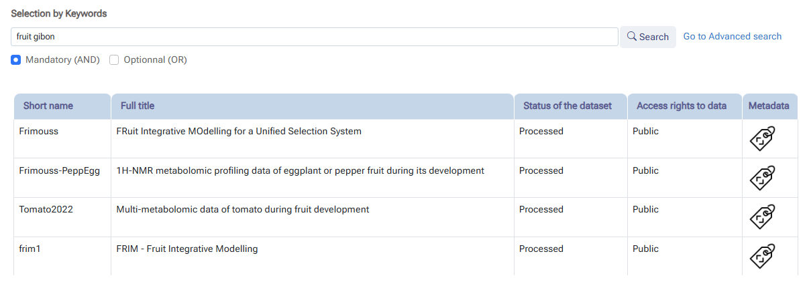
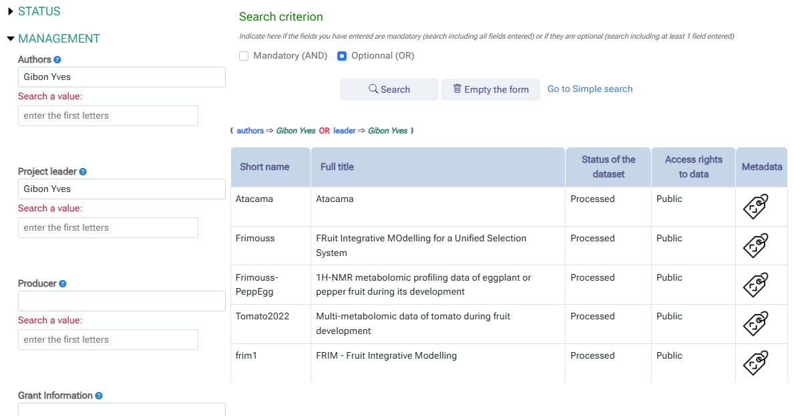

# Quick tutorial

### Search Datasets

Dataset searching can be done in two ways:

* a simple search relying on a unique “search bar” allowing you to enter a series of keywords to search in all fields in the database.
* an advanced search by specifying a keyword for each of the targeted fields

 

#### Simple search

From one or more keywords entered in the search bar, all datasets containing at least one keyword (OR) or all keywords (AND) are selected. Regardless of where the keywords are contained, whether in a single field or several fields, the relevance of the search is therefore conditioned by the correct documentation of the fields. However, this type of search allows for a quick selection without having to ask questions about the fields.

* Below, an example of a simple search using 2 keywords including an author's name.

 

 

#### Advanced search

Unlike a simple search, an advanced search requires specifying a keyword for each targeted field. This allows for greater relevance in the returned dataset list. On the other hand, setting up the search is more laborious and requires knowing a little about the fields, their definition and their content type.

* Below is an example of an advanced search using 2 targeted fields to search for the same person's contribution.

 

 
